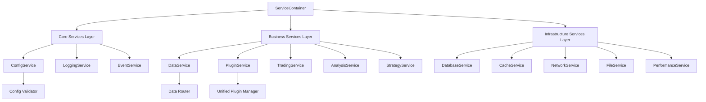

# Architecture Refactoring Design Document

## Overview

This design transforms the FactorWeave-Quant system from a chaotic 226-Manager architecture to a clean, service-oriented design with proper dependency injection, unified plugin management, and controlled service lifecycles. The refactoring follows a three-phase approach: stabilization, architecture selection, and systematic refactoring.

## Steering Document Alignment

### Technical Standards (tech.md)
This design follows established patterns for:
- Python service architecture with proper abstract base classes
- Dependency injection using container patterns
- Configuration management through centralized services
- Error handling with structured logging and proper exception hierarchies

### Project Structure (structure.md) 
Implementation maintains existing directory structure while consolidating:
- `core/services/` - Unified service layer (15 services max)
- `core/containers/` - Dependency injection framework
- `core/interfaces/` - Service contracts and abstractions
- `plugins/` - Unified plugin system

## Code Reuse Analysis

### Existing Components to Leverage
- **ServiceContainer**: Extend existing container with proper lifecycle management
- **EventBus**: Utilize for decoupled service communication
- **BaseService**: Establish as foundation for all new services
- **ConfigService**: Enhance with validation and change notification
- **LoguruManager**: Standardize as the single logging solution

### Integration Points
- **Database Layer**: Maintain existing DuckDB and SQLite connections
- **Plugin Interfaces**: Extend current plugin contracts with lifecycle methods
- **UI Components**: Preserve existing Qt/PyQt5 integration patterns
- **Data Sources**: Unify multiple data source managers into single DataService

## Architecture

The new architecture follows Domain-Driven Design principles with clear service boundaries:

### Modular Design Principles
- **Service Segregation**: Each service handles one business domain
- **Interface-First Design**: All services implement well-defined contracts
- **Dependency Inversion**: Services depend on abstractions, not implementations
- **Single Initialization**: Each service initializes exactly once through DI container



## Components and Interfaces

### Core Services Layer

#### ConfigService
- **Purpose:** Centralized configuration management with validation
- **Interfaces:** `IConfigService` with get/set/validate/notify methods  
- **Dependencies:** FileService for persistence, EventService for change notifications
- **Reuses:** Existing config.json structure, SQLite storage patterns

#### LoggingService  
- **Purpose:** Unified logging using Loguru with structured output
- **Interfaces:** `ILoggingService` with standard logging levels and structured data
- **Dependencies:** ConfigService for log levels and output configuration
- **Reuses:** Existing LoguruManager implementation

#### EventService
- **Purpose:** Decoupled inter-service communication
- **Interfaces:** `IEventService` with publish/subscribe patterns
- **Dependencies:** LoggingService for event auditing
- **Reuses:** Current EventBus implementation with enhancements

### Business Services Layer

#### DataService
- **Purpose:** Unified data access consolidating all Manager classes
- **Interfaces:** `IDataService` with standardized data retrieval methods
- **Dependencies:** DatabaseService, CacheService, NetworkService, PluginService
- **Reuses:** Existing data source connections, TET pipeline, DuckDB operations

#### PluginService
- **Purpose:** Single plugin management system replacing multiple managers
- **Interfaces:** `IPluginService` with discovery/lifecycle/management methods
- **Dependencies:** ConfigService for plugin settings, EventService for lifecycle events
- **Reuses:** Current plugin interfaces with standardized lifecycle

#### TradingService
- **Purpose:** Trading operations and portfolio management
- **Interfaces:** `ITradingService` with order management and risk controls
- **Dependencies:** DataService for market data, ConfigService for trading rules
- **Reuses:** Existing trading engine, risk management, position tracking

#### AnalysisService
- **Purpose:** Technical and fundamental analysis capabilities
- **Interfaces:** `IAnalysisService` with indicator calculation and pattern recognition
- **Dependencies:** DataService for historical data, CacheService for performance
- **Reuses:** Current indicator libraries, pattern recognition algorithms

#### StrategyService
- **Purpose:** Strategy development and execution management
- **Interfaces:** `IStrategyService` with strategy lifecycle and execution
- **Dependencies:** TradingService for execution, AnalysisService for signals
- **Reuses:** Existing strategy framework, backtest engine

### Infrastructure Services Layer

#### DatabaseService
- **Purpose:** Database connection and operation management
- **Interfaces:** `IDatabaseService` with transaction and query management
- **Dependencies:** ConfigService for connection strings
- **Reuses:** Current DuckDB and SQLite connections, table schemas

#### CacheService
- **Purpose:** Multi-level caching for performance optimization
- **Interfaces:** `ICacheService` with TTL and invalidation support
- **Dependencies:** ConfigService for cache settings
- **Reuses:** Existing cache implementations with proper eviction

#### NetworkService
- **Purpose:** HTTP/WebSocket connections and API management
- **Interfaces:** `INetworkService` with request/response handling
- **Dependencies:** ConfigService for endpoints and timeouts
- **Reuses:** Current network configurations, retry mechanisms

#### FileService
- **Purpose:** File system operations and resource management
- **Interfaces:** `IFileService` with CRUD operations and monitoring
- **Dependencies:** ConfigService for paths and permissions
- **Reuses:** Existing file handling patterns

#### PerformanceService
- **Purpose:** System monitoring and performance metrics
- **Interfaces:** `IPerformanceService` with metrics collection and reporting
- **Dependencies:** LoggingService for metric output
- **Reuses:** Current performance monitoring tools

## Data Models

### Service Registration Model
```python
@dataclass
class ServiceRegistration:
    interface_type: Type[ABC]
    implementation_type: Type
    lifecycle: ServiceLifecycle  # Singleton, Transient, Scoped
    dependencies: List[Type[ABC]]
    initialization_order: int
```

### Service Health Model
```python
@dataclass  
class ServiceHealth:
    service_name: str
    status: ServiceStatus  # Healthy, Degraded, Failed
    last_check: datetime
    error_message: Optional[str]
    metrics: Dict[str, Any]
```

### Plugin Lifecycle Model
```python
@dataclass
class PluginState:
    plugin_id: str
    name: str
    version: str
    status: PluginStatus  # Discovered, Validated, Initialized, Active, Failed
    dependencies: List[str]
    error_info: Optional[Exception]
```

## Error Handling

### Error Scenarios

1. **Service Initialization Failure**
   - **Handling:** Log detailed error, mark service as failed, prevent dependent services from starting
   - **User Impact:** Clear error message indicating which service failed and suggested actions

2. **Plugin Loading Failure**
   - **Handling:** Log plugin error, continue loading other plugins, provide degraded functionality
   - **User Impact:** Notification of unavailable plugins with option to retry or disable

3. **Configuration Validation Error**
   - **Handling:** Stop startup, display specific validation errors with field references
   - **User Impact:** Clear indication of invalid configuration with suggestions for correction

4. **Circular Dependency Detection**
   - **Handling:** Analyze dependency graph, report circular chains, fail fast
   - **User Impact:** Developer-focused error with dependency chain visualization

5. **Resource Exhaustion**
   - **Handling:** Implement circuit breakers, graceful degradation, resource cleanup
   - **User Impact:** Performance warnings with guidance on resource optimization

## Testing Strategy

### Unit Testing
- Each service implementation tested in isolation with mocked dependencies
- Configuration validation tested with various valid/invalid scenarios
- Plugin lifecycle tested with mock plugins and error conditions
- Service container tested for proper registration and resolution

### Integration Testing
- Service startup sequence tested end-to-end
- Plugin loading tested with real plugin implementations
- Data flow tested through service layers
- Error propagation tested across service boundaries

### End-to-End Testing
- Full system startup and shutdown cycles
- User workflow testing with new service architecture
- Performance regression testing comparing old vs new architecture
- Load testing to verify resource usage improvements

## Migration Strategy

### Phase 1: Stabilization (Weeks 1-2)
- Implement ServiceContainer with lifecycle management
- Add initialization guards to prevent duplicate service creation
- Create service health monitoring
- Establish baseline performance metrics

### Phase 2: Service Consolidation (Weeks 3-8)
- Group related Manager classes into service domains
- Implement new service interfaces and contracts
- Create adapter pattern for backward compatibility
- Migrate one service domain at a time

### Phase 3: Plugin Unification (Weeks 9-12)
- Consolidate multiple plugin managers into PluginService
- Implement standardized plugin lifecycle
- Migrate existing plugins to new interfaces
- Remove legacy plugin management code

### Phase 4: Optimization (Weeks 13-16)
- Remove backward compatibility adapters
- Optimize service initialization order
- Implement advanced caching strategies
- Performance tuning and monitoring enhancement

## Performance Targets

- **Startup Time**: Reduce from 20-30s to <15s
- **Memory Usage**: Reduce by 200-300MB through singleton enforcement
- **Service Resolution**: <1ms for registered services
- **Plugin Loading**: Parallel loading where dependencies allow
- **Configuration Loading**: <500ms for full configuration validation

## Monitoring and Health Checks

Each service will implement:
- Health check endpoint returning detailed status
- Performance metrics collection (response times, resource usage)
- Error rate monitoring with alert thresholds
- Dependency health validation
- Graceful degradation capabilities when dependencies fail
