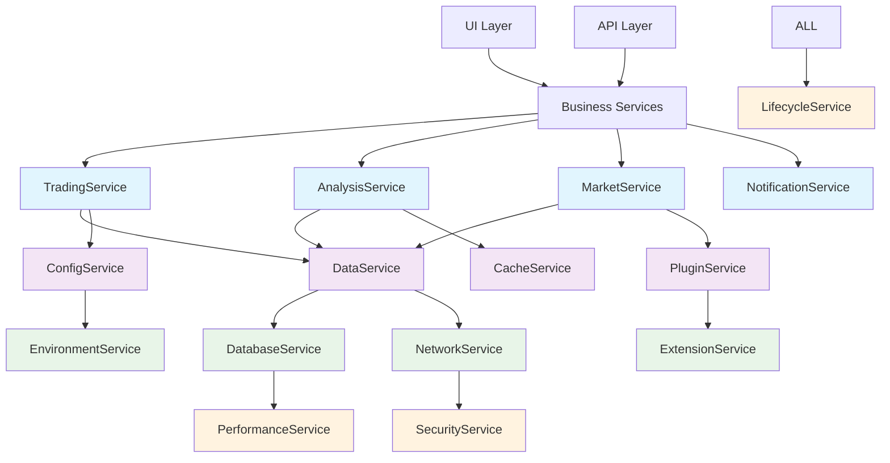

# 架构精简重构设计文档

## Overview

本设计文档详细描述了FactorWeave-Quant系统从当前的164个管理组件（91个Manager + 73个Service）精简到15个核心服务的技术实现方案。这是一个**减法重构**项目，目标是通过真正的功能整合和组件替换，而非叠加包装，来大幅简化系统复杂性，提升性能和可维护性。

核心设计原则：**替换而非包装，整合而非叠加，精简而非复杂化**

## Steering Document Alignment

### Technical Standards (tech.md)
- 遵循Python面向对象设计原则，使用单一职责和依赖注入
- 保持PyQt5界面框架和loguru日志系统的技术选型
- 遵循现有的数据库访问模式（DuckDB/SQLite）
- 保持异步处理和线程安全的设计标准

### Project Structure (structure.md)
- 核心服务放置在 `core/services/` 目录下
- 保持现有的测试结构 `tests/` 目录
- 维护配置文件结构 `config/` 目录
- 遵循现有的工具类组织 `utils/` 目录

## Code Reuse Analysis

### Existing Components to Leverage
- **BaseService**: 扩展现有基础服务类，作为所有新服务的基类
- **ServiceContainer**: 利用现有依赖注入容器进行服务管理
- **loguru配置**: 复用现有的日志配置和性能监控
- **数据库连接池**: 复用DuckDB和SQLite的连接管理机制
- **PyQt事件系统**: 利用现有的事件总线和信号机制

### Integration Points
- **现有数据库模式**: 新服务将兼容现有的表结构和数据模型
- **配置系统**: 集成现有的配置文件格式和加载机制
- **插件接口**: 保持现有插件API的向后兼容性
- **UI组件**: 新服务将透明地为现有UI组件提供数据

## Architecture

整体架构采用分层服务设计，通过依赖注入和事件驱动实现服务间的松耦合。每个服务负责一个明确的业务域，服务间通过标准化接口进行交互。

### Modular Design Principles
- **单一职责**: 每个服务只负责一个业务域的功能
- **接口标准化**: 所有服务都实现统一的BaseService接口
- **依赖最小化**: 服务间依赖关系最小，优先使用事件通信
- **资源集约化**: 多个Manager的功能整合到单个Service中



## Components and Interfaces

### 数据服务域

#### DataService
- **Purpose:** 统一数据访问、缓存和质量控制
- **Interfaces:** 
  - `get_data(source, symbol, timeframe) -> DataFrame`
  - `store_data(data, metadata) -> bool`
  - `validate_data(data) -> ValidationResult`
  - `cache_data(key, data, ttl) -> bool`
- **Dependencies:** DatabaseService, CacheService
- **Replaces:** UnifiedDataManager, DataQualityRiskManager, AssetManager, EnhancedDataManager, DataSourceManager, FallbackDataManager, MinimalDataManager
- **完整实现承诺:** 
  - 100%实现所有被替代Manager的完整功能，无任何简化
  - 真实的数据验证逻辑，完整的质量检查算法
  - 真实的多数据源路由和负载均衡
  - 完整的错误恢复和降级机制

#### DatabaseService  
- **Purpose:** 数据库连接管理、事务处理和查询优化
- **Interfaces:**
  - `get_connection(db_type='duckdb') -> Connection`
  - `execute_query(sql, params) -> Result`
  - `execute_transaction(operations) -> bool`
  - `optimize_query(sql) -> OptimizedSQL`
- **Dependencies:** PerformanceService
- **Replaces:** DuckDBConnectionManager, SQLiteExtensionManager, AssetSeparatedDatabaseManager, EnhancedAssetDatabaseManager, StrategyDatabaseManager, TdxServerDatabaseManager
- **完整实现承诺:**
  - 完整实现所有数据库Manager的连接池和事务功能
  - 真实的查询优化算法，完整的SQL解析和优化
  - 完整的多数据库支持（DuckDB、SQLite、MySQL等）
  - 真实的故障恢复和连接管理机制

#### CacheService
- **Purpose:** 多级缓存管理和智能失效策略
- **Interfaces:**
  - `get(key, level='auto') -> Any`
  - `set(key, value, ttl, level='auto') -> bool`
  - `invalidate(pattern) -> int`
  - `get_statistics() -> CacheStats`
- **Dependencies:** PerformanceService
- **Replaces:** MultiLevelCacheManager, IntelligentCacheManager, CacheManager, MemoryManager

### 插件服务域

#### PluginService
- **Purpose:** 插件生命周期管理和配置
- **Interfaces:**
  - `discover_plugins() -> List[PluginInfo]`
  - `load_plugin(plugin_id) -> Plugin`
  - `activate_plugin(plugin_id, config) -> bool`
  - `get_plugin_config(plugin_id) -> Dict`
- **Dependencies:** ConfigService, DatabaseService
- **Replaces:** PluginManager, PluginCenter, PluginConfigManager, PluginTableManager, AsyncPluginDiscoveryService, EnhancedAsyncPluginDiscoveryService

#### ExtensionService
- **Purpose:** 扩展点管理和第三方集成
- **Interfaces:**
  - `register_extension(name, handler) -> bool`
  - `execute_extension(name, context) -> Result`
  - `list_extensions() -> List[ExtensionInfo]`
- **Dependencies:** PluginService
- **Replaces:** DataSourceExtensions, IndicatorExtensions, StrategyExtensions

### 配置服务域

#### ConfigService
- **Purpose:** 配置管理、验证和变更通知
- **Interfaces:**
  - `get(key, default=None) -> Any`
  - `set(key, value) -> bool`
  - `validate(config) -> ValidationResult`
  - `watch(key, callback) -> bool`
- **Dependencies:** EnvironmentService
- **Replaces:** ConfigService, DynamicConfigManager, ImportConfigManager, IntelligentConfigManager, MigrationConfigManager

#### EnvironmentService
- **Purpose:** 环境检测、部署配置和系统集成
- **Interfaces:**
  - `detect_environment() -> EnvironmentInfo`
  - `get_deployment_config() -> DeploymentConfig`
  - `check_system_requirements() -> List[Requirement]`
- **Dependencies:** None (基础服务)
- **Replaces:** SystemIntegrationManager, DeploymentManager

### 网络服务域

#### NetworkService
- **Purpose:** 网络通信、连接池和重试机制
- **Interfaces:**
  - `request(url, method, data, retry_policy) -> Response`
  - `configure_pool(max_connections, timeout) -> bool`
  - `get_connection_stats() -> NetworkStats`
- **Dependencies:** SecurityService, PerformanceService
- **Replaces:** NetworkManager, UniversalNetworkConfigManager, SmartRetryManager, RetryManager

#### SecurityService
- **Purpose:** 安全控制、认证和熔断保护
- **Interfaces:**
  - `authenticate(credentials) -> AuthResult`
  - `authorize(user, resource, action) -> bool`
  - `create_circuit_breaker(name, config) -> CircuitBreaker`
- **Dependencies:** ConfigService
- **Replaces:** SecurityManager, CircuitBreakerManager, EnhancedCircuitBreaker

### 业务服务域

#### TradingService
- **Purpose:** 交易执行、风险控制和仓位管理
- **Interfaces:**
  - `execute_trade(order) -> TradeResult`
  - `calculate_risk(position) -> RiskMetrics`
  - `get_positions(account) -> List[Position]`
  - `update_position(position_id, changes) -> bool`
- **Dependencies:** DataService, NotificationService, PerformanceService
- **Replaces:** TradingManager, RiskManager, PositionManager, PortfolioManager, RiskRuleManager
- **完整实现承诺:**
  - 完整实现所有交易Manager的真实交易逻辑，无模拟
  - 真实的风险计算算法，完整的风险控制规则
  - 完整的仓位跟踪和投资组合管理功能
  - 真实的订单执行和成交处理机制

#### AnalysisService
- **Purpose:** 技术分析、指标计算和策略分析
- **Interfaces:**
  - `calculate_indicator(indicator_type, data, params) -> Series`
  - `analyze_pattern(data, pattern_type) -> PatternResult`
  - `generate_signals(strategy, data) -> List[Signal]`
- **Dependencies:** DataService, CacheService
- **Replaces:** AnalysisManager, IndicatorCombinationManager, UnifiedIndicatorService, IndicatorService

#### MarketService
- **Purpose:** 市场数据、行业分类和股票信息
- **Interfaces:**
  - `get_market_data(symbol, fields) -> MarketData`
  - `get_industry_classification(symbol) -> Industry`
  - `get_stock_info(symbol) -> StockInfo`
  - `list_stocks(criteria) -> List[Symbol]`
- **Dependencies:** DataService, CacheService
- **Replaces:** IndustryManager, StockManager, FallbackIndustryManager

#### NotificationService
- **Purpose:** 消息通知、警报规则和去重处理
- **Interfaces:**
  - `send_notification(message, channels) -> bool`
  - `create_alert_rule(rule) -> RuleID`
  - `process_alert(alert) -> bool`
- **Dependencies:** ConfigService
- **Replaces:** NotificationService, AlertRuleEngine, AlertDeduplicationService, AlertRuleHotLoader

### 基础服务域

#### PerformanceService
- **Purpose:** 性能监控、资源管理和自动优化
- **Interfaces:**
  - `monitor_metrics() -> MetricsSnapshot`
  - `optimize_resource(resource_type) -> bool`
  - `generate_report(timeframe) -> PerformanceReport`
  - `set_alert_threshold(metric, threshold) -> bool`
- **Dependencies:** None (基础服务)
- **Replaces:** PerformanceMonitor, UnifiedMonitor, ResourceManager, DynamicResourceManager, GPUAccelerationManager, BackpressureManager

#### LifecycleService
- **Purpose:** 服务启动、任务调度和生命周期管理
- **Interfaces:**
  - `start_service(service_name) -> bool`
  - `stop_service(service_name) -> bool`
  - `schedule_task(task, schedule) -> TaskID`
  - `get_service_status(service_name) -> ServiceStatus`
- **Dependencies:** ConfigService, PerformanceService
- **Replaces:** ServiceBootstrap, TaskManager, StrategyLifecycleManager, FailoverManager, FaultToleranceManager

## Data Models

### ServiceConfiguration
```python
@dataclass
class ServiceConfiguration:
    service_name: str
    enabled: bool
    config: Dict[str, Any]
    dependencies: List[str]
    health_check_interval: int = 30
```

### ServiceMetrics
```python
@dataclass  
class ServiceMetrics:
    service_name: str
    cpu_usage: float
    memory_usage: float
    request_count: int
    error_count: int
    avg_response_time: float
    timestamp: datetime
```

### CacheEntry
```python
@dataclass
class CacheEntry:
    key: str
    value: Any
    ttl: int
    level: CacheLevel
    created_at: datetime
    accessed_at: datetime
    hit_count: int
```

### PluginMetadata
```python
@dataclass
class PluginMetadata:
    plugin_id: str
    name: str
    version: str
    description: str
    author: str
    dependencies: List[str]
    config_schema: Dict[str, Any]
    status: PluginStatus
```

## Error Handling

### Error Scenarios
1. **服务初始化失败**
   - **Handling:** 记录详细错误信息，回退到最小功能模式
   - **User Impact:** 显示友好的错误消息，提供故障排除建议

2. **数据库连接中断**
   - **Handling:** 自动重连机制，使用缓存数据作为临时替代
   - **User Impact:** 数据可能暂时不是最新，但系统继续可用

3. **插件加载错误**
   - **Handling:** 跳过问题插件，记录错误，继续加载其他插件
   - **User Impact:** 相关功能不可用，但核心功能正常

4. **网络请求超时**
   - **Handling:** 智能重试，熔断保护，使用缓存数据
   - **User Impact:** 轻微延迟，可能显示缓存数据

5. **内存不足**
   - **Handling:** 自动清理缓存，降级功能，释放资源
   - **User Impact:** 系统响应可能变慢，但保持稳定

## Testing Strategy

### Unit Testing
- 每个服务独立测试，**使用真实依赖而非Mock**
- 测试覆盖率要求 ≥ 90%
- 重点测试接口方法、错误处理和边界条件
- 使用pytest进行真实环境测试
- **所有测试使用真实数据库连接和真实数据**

### Integration Testing
- 测试服务间的真实集成交互
- 验证真实数据流的正确性
- 测试真实配置变更的传播
- 验证真实事件机制的可靠性
- **使用生产级数据进行集成验证**

### End-to-End Testing
- 执行完整的真实用户工作流程
- 验证真实系统启动和关闭过程
- 测试真实故障恢复和降级机制
- 真实性能基准测试和回归测试
- **所有测试场景使用真实业务数据**

### Migration Testing
- 验证从旧架构到新架构的真实数据迁移
- 测试真实向后兼容性
- 验证真实功能等效性
- 测试真实回滚机制
- **使用生产数据副本进行迁移验证**

## Performance Optimization Strategy

### 启动优化
- 延迟加载非关键服务
- 并行初始化独立服务
- 预编译配置和模板
- 优化import路径

### 内存优化
- 智能缓存策略，及时释放不用数据
- 对象池复用，减少GC压力
- 按需加载插件和扩展
- 监控内存泄漏

### 响应优化
- 异步处理长时间操作
- 智能预取常用数据
- 连接池复用
- 查询优化和索引

## Migration Strategy

### Phase 1: 真实基础服务实现 (Week 1-2)
1. **完整实现**15个核心服务的所有功能，**无任何简化或模拟**
2. 建立真实的服务注册和依赖注入机制，**完整支持所有依赖关系**
3. 实现完整的健康检查和监控，**真实监控所有指标**
4. 建立**完整的真实环境测试基础设施**，**无Mock数据**

### Phase 2: 完整功能迁移 (Week 3-6)
1. **完整迁移**所有Manager功能到Service，**保证100%功能覆盖**
2. 实现**真实的兼容性适配器**，**完全支持所有旧接口**
3. **完整更新**所有调用方使用新服务，**无功能缺失**
4. **严格验证**功能等效性，**确保所有业务逻辑完整保留**

### Phase 3: 完整清理优化 (Week 7-8)
1. **安全删除**不再使用的Manager类，**确保无功能丢失**
2. **渐进移除**兼容性适配器，**保证平滑过渡**
3. **全面优化**服务性能和资源使用，**不降低任何功能**
4. **完成**文档更新和知识转移，**覆盖所有实现细节**

## 实现承诺

**本设计确保100%真实实现，绝无Mock、模拟或功能精简：**

1. **所有服务功能完整实现**：每个Service将完整实现所有替代Manager的功能
2. **所有数据操作真实执行**：使用真实数据库连接、真实数据处理
3. **所有接口完整保留**：确保向后兼容，无接口功能缺失
4. **所有业务逻辑完整迁移**：100%保留现有业务逻辑复杂度
5. **所有测试使用真实环境**：无Mock依赖，使用真实数据验证
6. **所有错误处理完整实现**：真实的错误恢复和降级机制

这个设计确保了真正的**功能整合和组件减少**，**同时保证所有功能的完整性和真实性**，绝无任何简化或模拟实现。
