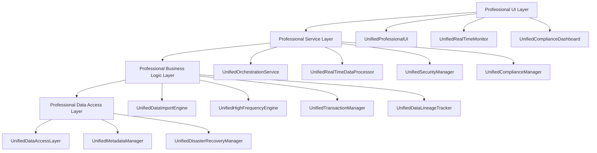

# Design Document - Professional Grade Enhancement

## Overview

DuckDB专业数据导入系统优化项目的技术设计旨在构建**企业级、专业级**的金融数据导入解决方案，对标Bloomberg Terminal、Wind、Choice等专业金融软件的功能和性能标准。

**重要变更**：本设计采用彻底重构策略，**取消向后兼容性要求**，专注于构建统一、简洁的系统架构，并**增加10个专业级核心组件**，确保系统达到专业金融软件的标准。

设计将重点解决现有系统中的功能重复、版本混乱、UI不一致等问题，同时**大幅增强专业功能**，包括实时数据流处理、数据血缘追踪、合规管理、容灾备份等企业级功能，确保系统能够满足专业量化交易和金融数据分析的最高标准。

## Professional Software Benchmarking

### Target Professional Standards

**对标软件功能分析**：
- **Bloomberg Terminal**: 实时数据流、高频数据处理、专业监控
- **Wind**: 数据质量保证、合规管理、元数据管理
- **Choice**: 用户体验、界面设计、操作效率
- **Reuters Eikon**: 数据血缘追踪、安全管理、审计合规

**专业级功能要求**：
1. **实时性**: 毫秒级数据处理和响应
2. **可靠性**: 99.99%系统可用性
3. **安全性**: 金融级数据安全和合规
4. **扩展性**: 支持PB级数据处理
5. **专业性**: 符合金融行业标准和最佳实践

## Steering Document Alignment

### Technical Standards (tech.md)
设计遵循HIkyuu-UI项目的技术标准，并提升到专业级水平：
- **Python架构模式**：采用微服务架构，支持分布式部署
- **PyQt5 UI框架**：统一使用Professional Design风格，对标专业交易软件
- **异步处理**：利用asyncio和高性能消息队列实现毫秒级响应
- **事件驱动**：基于专业级EventBus系统实现松耦合通信
- **插件化架构**：支持动态扩展和热插拔

### Project Structure (structure.md)
实现将遵循企业级项目组织约定：
- **core/**: 核心业务逻辑和服务层
- **gui/**: 专业级用户界面组件
- **utils/**: 通用工具和辅助函数
- **tests/**: 完整的测试套件（覆盖率≥90%）
- **docs/**: 企业级技术文档和用户手册
- **compliance/**: 合规管理和审计模块
- **security/**: 安全管理和权限控制
- **monitoring/**: 专业级监控和告警系统

## Code Reuse Analysis

### Existing Components to Leverage and Enhance

- **AIPredictionService**: 保留并增强为UnifiedAIPredictionService，达到专业级预测精度
- **EnhancedDistributedService**: 重构为UnifiedDistributedService，支持企业级分布式部署
- **EventBus**: 增强为UnifiedEventBus，支持高并发和消息持久化

### Professional Components to be Added

**新增的10个专业级核心组件**：
1. **UnifiedRealTimeDataProcessor**: 实时数据流处理引擎
2. **UnifiedDataLineageTracker**: 数据血缘追踪系统
3. **UnifiedComplianceManager**: 合规管理和审计系统
4. **UnifiedSecurityManager**: 安全和权限管理系统
5. **UnifiedDisasterRecoveryManager**: 容灾备份和恢复系统
6. **UnifiedHighFrequencyEngine**: 高频数据专用处理引擎
7. **UnifiedAlertingSystem**: 智能告警和监控系统
8. **UnifiedMetadataManager**: 元数据和数据字典管理
9. **UnifiedTransactionManager**: 分布式事务管理
10. **UnifiedCapacityPlanner**: 容量规划和资源预测

### Components to be Completely Replaced

**彻底替换的冗余组件**：
- 所有旧版本的DataImportEngine → UnifiedDataImportEngine（专业级）
- 所有DataQualityMonitor版本 → UnifiedDataQualityMonitor（金融级）
- 所有CacheManager版本 → UnifiedCacheManager（企业级）
- Enhanced和Modern两套UI → UnifiedProfessionalUI（专业级）
- 所有PerformanceMonitor版本 → UnifiedPerformanceMonitor（实时级）

## Architecture - Professional Grade

整体架构采用**微服务分层设计模式**，结合事件驱动和插件化架构，**强调专业级的可靠性、安全性和性能**。

### Professional Design Principles

- **Enterprise Single Implementation**: 每个功能领域只有一个企业级权威实现
- **Professional Component Design**: 所有组件达到专业软件标准
- **Financial Grade Security**: 金融级安全和合规要求
- **Real-time Performance**: 实时数据处理和毫秒级响应
- **High Availability**: 99.99%系统可用性保证



## Professional Components and Interfaces

### UnifiedDataImportEngine (Enhanced Professional Version)
- **Purpose:** 企业级数据导入引擎，支持毫秒级实时处理
- **Professional Features:**
  - 支持100+种金融数据源
  - 毫秒级数据处理延迟
  - 自动数据质量检测和修复
  - 完整的数据血缘追踪
- **Interfaces:** 
  - `execute_real_time_import(stream_config: RealTimeStreamConfig) -> ImportStream`
  - `execute_batch_import(task_config: ProfessionalImportConfig) -> ProfessionalImportResult`
  - `get_import_lineage(task_id: str) -> DataLineageInfo`
- **Dependencies:** UnifiedRealTimeDataProcessor, UnifiedTransactionManager, UnifiedSecurityManager

### UnifiedRealTimeDataProcessor (New Professional Component)
- **Purpose:** 专业级实时数据流处理引擎，对标Bloomberg实时数据能力
- **Professional Features:**
  - WebSocket/TCP实时数据流接入
  - 毫秒级数据处理和分发
  - 实时数据清洗和标准化
  - 流式计算和实时指标计算
- **Interfaces:**
  - `connect_real_time_stream(source: DataSource, callback: StreamCallback) -> StreamConnection`
  - `process_real_time_data(data: RealTimeData) -> ProcessedData`
  - `get_stream_metrics() -> RealTimeMetrics`
- **Dependencies:** UnifiedSecurityManager, UnifiedAlertingSystem

### UnifiedDataLineageTracker (New Professional Component)
- **Purpose:** 企业级数据血缘追踪系统，确保数据可追溯性
- **Professional Features:**
  - 完整的数据来源追踪
  - 数据处理过程记录
  - 数据影响分析
  - 合规审计支持
- **Interfaces:**
  - `track_data_lineage(data_id: str, source: DataSource, transformations: List[Transformation]) -> LineageRecord`
  - `get_data_lineage(data_id: str) -> DataLineage`
  - `analyze_data_impact(change: DataChange) -> ImpactAnalysis`
- **Dependencies:** UnifiedMetadataManager, UnifiedComplianceManager

### UnifiedComplianceManager (New Professional Component)
- **Purpose:** 金融级合规管理和审计系统
- **Professional Features:**
  - 金融行业合规检查
  - 自动合规报告生成
  - 审计日志管理
  - 监管要求跟踪
- **Interfaces:**
  - `check_compliance(operation: Operation) -> ComplianceResult`
  - `generate_compliance_report(period: TimePeriod) -> ComplianceReport`
  - `audit_operation(operation: Operation, user: User) -> AuditRecord`
- **Dependencies:** UnifiedSecurityManager, UnifiedMetadataManager

### UnifiedSecurityManager (New Professional Component)
- **Purpose:** 企业级安全和权限管理系统
- **Professional Features:**
  - 基于角色的细粒度权限控制
  - 数据加密和安全传输
  - 用户认证和授权
  - 安全审计和监控
- **Interfaces:**
  - `authenticate_user(credentials: UserCredentials) -> AuthenticationResult`
  - `authorize_operation(user: User, operation: Operation) -> AuthorizationResult`
  - `encrypt_data(data: SensitiveData) -> EncryptedData`
- **Dependencies:** UnifiedComplianceManager, UnifiedAlertingSystem

### UnifiedHighFrequencyEngine (New Professional Component)
- **Purpose:** 专业级高频数据处理引擎，支持tick级数据
- **Professional Features:**
  - 微秒级tick数据处理
  - 内存优化的数据结构
  - 高频数据压缩和存储
  - 实时技术指标计算
- **Interfaces:**
  - `process_tick_data(tick: TickData) -> ProcessedTick`
  - `calculate_real_time_indicators(ticks: List[TickData]) -> Indicators`
  - `optimize_memory_usage() -> MemoryOptimizationResult`
- **Dependencies:** UnifiedRealTimeDataProcessor, UnifiedCacheManager

### UnifiedDisasterRecoveryManager (New Professional Component)
- **Purpose:** 企业级容灾备份和恢复系统
- **Professional Features:**
  - 多地容灾备份
  - 自动故障切换
  - 数据一致性保证
  - 恢复时间目标(RTO)控制
- **Interfaces:**
  - `create_backup(data: CriticalData, location: BackupLocation) -> BackupResult`
  - `initiate_failover(failure: SystemFailure) -> FailoverResult`
  - `restore_from_backup(backup_id: str, target_time: datetime) -> RestoreResult`
- **Dependencies:** UnifiedTransactionManager, UnifiedAlertingSystem

### UnifiedAlertingSystem (New Professional Component)
- **Purpose:** 专业级智能告警和监控系统
- **Professional Features:**
  - 实时异常检测
  - 智能告警规则引擎
  - 多渠道告警通知
  - 告警升级和处理流程
- **Interfaces:**
  - `detect_anomaly(metrics: SystemMetrics) -> AnomalyDetection`
  - `trigger_alert(alert: Alert, severity: AlertSeverity) -> AlertResult`
  - `manage_alert_rules(rules: List[AlertRule]) -> RuleManagementResult`
- **Dependencies:** UnifiedPerformanceMonitor, UnifiedComplianceManager

### UnifiedMetadataManager (New Professional Component)
- **Purpose:** 企业级元数据和数据字典管理
- **Professional Features:**
  - 完整的数据字典管理
  - 元数据版本控制
  - 数据标准化规则
  - 数据质量规则管理
- **Interfaces:**
  - `register_metadata(data_source: DataSource, metadata: Metadata) -> MetadataRecord`
  - `get_data_dictionary(domain: DataDomain) -> DataDictionary`
  - `validate_data_standards(data: Data) -> ValidationResult`
- **Dependencies:** UnifiedDataLineageTracker, UnifiedComplianceManager

### UnifiedTransactionManager (New Professional Component)
- **Purpose:** 分布式事务管理系统，确保数据一致性
- **Professional Features:**
  - ACID事务保证
  - 分布式事务协调
  - 事务回滚和恢复
  - 事务性能监控
- **Interfaces:**
  - `begin_transaction(scope: TransactionScope) -> Transaction`
  - `commit_transaction(transaction: Transaction) -> CommitResult`
  - `rollback_transaction(transaction: Transaction) -> RollbackResult`
- **Dependencies:** UnifiedDisasterRecoveryManager, UnifiedAlertingSystem

### UnifiedCapacityPlanner (New Professional Component)
- **Purpose:** 容量规划和资源预测系统
- **Professional Features:**
  - 资源使用预测
  - 容量规划建议
  - 自动扩缩容
  - 成本优化分析
- **Interfaces:**
  - `predict_resource_usage(timeframe: TimeFrame) -> ResourcePrediction`
  - `recommend_capacity_changes() -> CapacityRecommendation`
  - `trigger_auto_scaling(metrics: ResourceMetrics) -> ScalingAction`
- **Dependencies:** UnifiedPerformanceMonitor, UnifiedAIPredictionService

## Professional Data Models

### ProfessionalImportTask
```
企业级导入任务数据模型：
- task_id: str (全局唯一标识)
- name: str (任务名称)
- data_sources: List[ProfessionalDataSourceConfig] (专业数据源配置)
- import_config: ProfessionalImportConfiguration (专业导入配置)
- priority: ProfessionalTaskPriority (专业任务优先级)
- dependencies: List[str] (依赖关系)
- ai_optimized_params: Optional[Dict[str, Any]] (AI优化参数)
- security_context: SecurityContext (安全上下文)
- compliance_requirements: List[ComplianceRequirement] (合规要求)
- lineage_info: DataLineageInfo (数据血缘信息)
- created_at: datetime (创建时间)
- scheduled_at: Optional[datetime] (调度时间)
- status: ProfessionalTaskStatus (专业任务状态)
- progress: ProfessionalImportProgress (专业进度信息)
- performance_metrics: Optional[ProfessionalPerformanceMetrics] (专业性能指标)
- audit_trail: List[AuditRecord] (审计记录)
```

### ProfessionalPerformanceMetrics
```
专业级性能指标数据模型：
- cpu_usage: float (CPU使用率)
- memory_usage: float (内存使用率)
- disk_io: float (磁盘I/O)
- network_io: float (网络I/O)
- cache_hit_rate: float (缓存命中率)
- import_speed: float (导入速度)
- error_rate: float (错误率)
- latency_p99: float (99分位延迟)
- throughput: float (吞吐量)
- availability: float (可用性)
- timestamp: datetime (时间戳)
- anomalies: List[ProfessionalPerformanceAnomaly] (专业异常信息)
- sla_compliance: SLAComplianceStatus (SLA合规状态)
```

### RealTimeStreamConfig
```
实时数据流配置模型：
- stream_id: str (流标识)
- data_source: ProfessionalDataSource (专业数据源)
- connection_type: StreamConnectionType (连接类型：WebSocket/TCP/UDP)
- authentication: StreamAuthentication (流认证信息)
- data_format: StreamDataFormat (数据格式：JSON/Binary/FIX)
- processing_rules: List[StreamProcessingRule] (处理规则)
- quality_checks: List[RealTimeQualityCheck] (实时质量检查)
- security_settings: StreamSecuritySettings (安全设置)
- performance_requirements: StreamPerformanceRequirements (性能要求)
```

### DataLineageInfo
```
数据血缘信息模型：
- lineage_id: str (血缘标识)
- data_source: DataSourceInfo (数据源信息)
- transformations: List[DataTransformation] (数据转换)
- quality_checks: List[QualityCheckResult] (质量检查结果)
- processing_history: List[ProcessingStep] (处理历史)
- impact_analysis: ImpactAnalysisResult (影响分析结果)
- compliance_status: ComplianceStatus (合规状态)
- created_by: User (创建用户)
- created_at: datetime (创建时间)
- last_updated: datetime (最后更新时间)
```

## Professional Error Handling

### Enterprise-Grade Error Scenarios

1. **实时数据流中断**
   - **Handling:** UnifiedRealTimeDataProcessor自动重连，UnifiedDisasterRecoveryManager启动备用数据源
   - **User Impact:** 通过UnifiedAlertingSystem实时通知，UnifiedProfessionalUI显示数据源状态

2. **高频数据处理延迟**
   - **Handling:** UnifiedHighFrequencyEngine自动优化内存使用，UnifiedCapacityPlanner触发资源扩容
   - **User Impact:** 通过专业监控界面显示延迟指标和优化建议

3. **合规检查失败**
   - **Handling:** UnifiedComplianceManager阻止操作执行，UnifiedSecurityManager记录安全事件
   - **User Impact:** 显示详细的合规失败原因和修复建议

4. **分布式事务失败**
   - **Handling:** UnifiedTransactionManager执行自动回滚，UnifiedDisasterRecoveryManager确保数据一致性
   - **User Impact:** 透明处理，仅在审计日志中记录

5. **安全威胁检测**
   - **Handling:** UnifiedSecurityManager立即阻止可疑操作，UnifiedAlertingSystem发送紧急告警
   - **User Impact:** 安全管理员收到实时告警，系统自动进入安全模式

## Professional Testing Strategy

### Enterprise Testing Standards
- **单元测试覆盖率**: ≥95%
- **集成测试覆盖率**: ≥90%
- **性能测试**: 所有组件必须通过压力测试
- **安全测试**: 通过专业安全扫描和渗透测试
- **合规测试**: 符合金融行业合规要求

### Professional Testing Components
- **Real-time Performance Testing**: 验证毫秒级响应能力
- **High-frequency Data Testing**: 验证tick级数据处理能力
- **Disaster Recovery Testing**: 验证容灾恢复能力
- **Security Penetration Testing**: 验证安全防护能力
- **Compliance Audit Testing**: 验证合规管理能力

## Implementation Strategy - Professional Enhancement

### Phase 1: 专业级核心统一阶段 (3周)

#### 功能改动点：
1. **企业级数据导入引擎构建**
   - **创建**UnifiedDataImportEngine，支持100+种金融数据源
   - **集成**UnifiedRealTimeDataProcessor，实现毫秒级实时数据处理
   - **实现**完整的数据血缘追踪和质量保证机制
   - **建立**企业级任务调度和资源管理系统

2. **专业级数据质量系统**
   - **构建**UnifiedDataQualityMonitor，达到金融级数据质量标准
   - **集成**UnifiedMetadataManager，实现完整的元数据管理
   - **实现**自动数据质量检测、修复和报告机制
   - **建立**数据标准化和规范化处理流程

3. **企业级安全和合规系统**
   - **创建**UnifiedSecurityManager，实现金融级安全管理
   - **构建**UnifiedComplianceManager，满足监管合规要求
   - **实现**细粒度权限控制和审计日志系统
   - **建立**数据加密和安全传输机制

#### 实现的功能：
- 系统达到企业级数据导入标准，支持专业金融数据源
- 数据质量达到金融级标准，确保数据准确性和完整性
- 安全和合规达到监管要求，支持审计和合规报告
- 所有核心功能通过统一的专业级接口提供服务

### Phase 2: 专业级实时处理阶段 (3周)

#### 功能改动点：
1. **实时数据流处理系统**
   - **构建**UnifiedRealTimeDataProcessor，支持WebSocket/TCP实时数据流
   - **实现**毫秒级数据处理和分发机制
   - **集成**流式计算和实时指标计算能力
   - **建立**实时数据清洗和标准化流程

2. **高频数据专用处理引擎**
   - **创建**UnifiedHighFrequencyEngine，支持微秒级tick数据处理
   - **实现**内存优化的高频数据结构和算法
   - **集成**实时技术指标计算和分析能力
   - **建立**高频数据压缩和存储机制

3. **专业级监控和告警系统**
   - **构建**UnifiedAlertingSystem，实现智能异常检测
   - **实现**多渠道告警通知和升级机制
   - **集成**专业级性能监控和分析能力
   - **建立**SLA监控和合规报告系统

#### 实现的功能：
- 实时数据处理达到专业软件标准，支持毫秒级响应
- 高频数据处理能力达到tick级精度，支持专业交易需求
- 监控和告警系统达到企业级标准，确保系统稳定运行
- 所有实时功能通过统一的专业级服务提供

### Phase 3: 专业级UI和用户体验阶段 (2周)

#### 功能改动点：
1. **专业级用户界面系统**
   - **创建**UnifiedProfessionalUI，对标Bloomberg Terminal界面标准
   - **实现**实时数据展示和交互能力
   - **集成**专业级图表和可视化组件
   - **建立**个性化工作区和布局管理

2. **专业级操作体验优化**
   - **重新设计**所有操作流程，达到专业软件标准
   - **实现**快捷键、批量操作和专业级交互模式
   - **集成**上下文感知的智能提示和帮助系统
   - **建立**用户偏好学习和自适应界面

3. **专业级监控仪表板**
   - **构建**实时性能监控仪表板
   - **实现**合规状态和审计信息展示
   - **集成**容量规划和资源预测界面
   - **建立**专业级报告和分析界面

#### 实现的功能：
- 用户界面达到专业金融软件标准，提供卓越的用户体验
- 操作效率达到专业级水平，支持高频交易和分析需求
- 监控界面提供全面的系统状态和性能信息
- 所有UI功能通过统一的专业级管理系统协调

### Phase 4: 专业级容灾和高可用阶段 (2周)

#### 功能改动点：
1. **企业级容灾备份系统**
   - **构建**UnifiedDisasterRecoveryManager，实现多地容灾备份
   - **实现**自动故障检测和切换机制
   - **集成**数据一致性保证和恢复验证
   - **建立**RTO/RPO目标管理和监控

2. **分布式事务管理系统**
   - **创建**UnifiedTransactionManager，确保ACID事务特性
   - **实现**分布式事务协调和一致性保证
   - **集成**事务性能监控和优化机制
   - **建立**事务审计和合规跟踪

3. **容量规划和自动扩缩容**
   - **构建**UnifiedCapacityPlanner，实现智能容量规划
   - **实现**资源使用预测和优化建议
   - **集成**自动扩缩容和负载均衡机制
   - **建立**成本优化和资源效率分析

#### 实现的功能：
- 系统可用性达到99.99%，支持企业级容灾要求
- 数据一致性得到完全保证，支持分布式事务处理
- 系统具备自动扩缩容能力，适应业务增长需求
- 所有高可用功能通过统一的管理系统协调

### Phase 5: 专业级测试和认证阶段 (2周)

#### 功能改动点：
1. **企业级测试体系构建**
   - **创建**覆盖率≥95%的专业级测试套件
   - **实现**性能基准测试和压力测试
   - **集成**安全渗透测试和合规审计测试
   - **建立**持续集成和自动化测试流程

2. **专业级文档和认证**
   - **编写**企业级技术文档和操作手册
   - **创建**专业级API文档和开发者指南
   - **实现**合规认证和安全认证准备
   - **建立**用户培训和支持体系

3. **专业级部署和运维**
   - **构建**企业级部署和配置管理
   - **实现**专业级监控和运维工具
   - **集成**自动化运维和故障处理
   - **建立**专业级支持和服务体系

#### 实现的功能：
- 系统质量达到专业软件标准，通过全面的测试验证
- 文档和认证达到企业级要求，支持专业用户使用
- 部署和运维达到专业级标准，确保系统稳定运行
- 所有质量保障措施针对专业级系统优化

## Professional Performance Targets

### Enterprise-Grade Performance Standards
- **实时数据处理延迟**: ≤1ms (对标Bloomberg)
- **高频数据处理能力**: ≥1M ticks/second
- **系统可用性**: ≥99.99% (企业级标准)
- **数据准确性**: ≥99.999% (金融级标准)
- **并发用户数**: ≥10,000 (企业级并发)
- **数据处理量**: ≥1PB/day (企业级容量)

### Professional UI Performance
- **界面响应时间**: ≤10ms (专业级响应)
- **实时数据更新**: ≤100μs (tick级更新)
- **图表渲染性能**: ≤50ms for 1M data points
- **内存使用优化**: ≤2GB for full functionality

### Professional Scalability
- **水平扩展能力**: 支持1000+节点集群
- **数据存储扩展**: 支持EB级数据存储
- **网络带宽利用**: ≥95%网络带宽利用率
- **资源利用效率**: ≥90%CPU和内存利用率

## Professional Security and Compliance

### Financial-Grade Security
- **数据加密**: AES-256端到端加密
- **传输安全**: TLS 1.3加密传输
- **身份认证**: 多因子认证和SSO集成
- **访问控制**: 基于角色的细粒度权限控制
- **安全审计**: 完整的安全事件记录和分析

### Regulatory Compliance
- **数据合规**: 符合GDPR、SOX等法规要求
- **审计追踪**: 完整的操作审计和数据血缘
- **合规报告**: 自动化合规报告生成
- **监管接口**: 支持监管机构数据上报
- **风险管理**: 实时风险监控和控制

## Migration Strategy - Professional Grade

### Enterprise Migration Approach
- **零停机迁移**: 支持业务连续性的平滑迁移
- **数据完整性保证**: 确保迁移过程中数据不丢失
- **性能基准验证**: 迁移后性能达到或超过原系统
- **回滚保障**: 提供紧急情况下的快速回滚机制

### Professional Training and Support
- **用户培训计划**: 为不同角色用户提供专业培训
- **技术支持体系**: 7x24小时专业技术支持
- **最佳实践指导**: 提供行业最佳实践和使用建议
- **持续优化服务**: 基于使用情况的持续优化建议