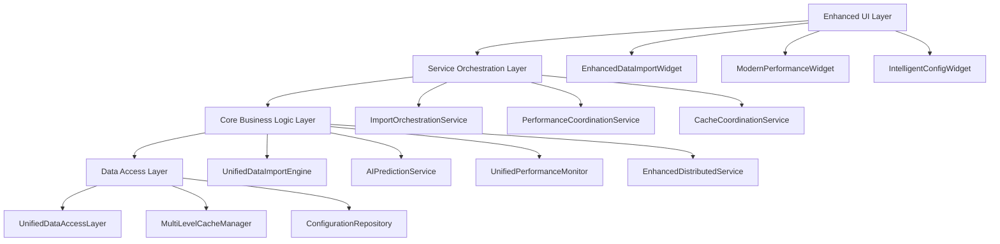

# Design Document

## Overview

DuckDB专业数据导入系统优化项目的技术设计旨在基于现有的丰富功能基础，通过系统性的架构重构、功能整合和性能优化，构建一个统一、高效、智能的数据导入解决方案。

设计将重点解决现有系统中的功能重复、版本混乱、UI不一致等问题，同时保持向后兼容性，确保平滑的系统升级过程。整个设计遵循模块化、可扩展、高性能的原则，为量化交易和金融数据分析提供企业级的数据导入能力。

## Steering Document Alignment

### Technical Standards (tech.md)
设计遵循HIkyuu-UI项目的技术标准：
- **Python架构模式**：采用分层架构，清晰分离业务逻辑、数据访问和表示层
- **PyQt5 UI框架**：统一使用Modern Design风格，提供一致的用户体验
- **异步处理**：利用QThread和asyncio实现高性能的并发数据处理
- **事件驱动**：基于现有的EventBus系统实现松耦合的组件通信
- **插件化架构**：支持数据源、处理器和输出格式的动态扩展

### Project Structure (structure.md)
实现将遵循项目的组织约定：
- **core/**: 核心业务逻辑和服务层
- **gui/**: 用户界面组件和对话框
- **utils/**: 通用工具和辅助函数
- **tests/**: 完整的测试套件
- **docs/**: 技术文档和用户手册

## Code Reuse Analysis

### Existing Components to Leverage

- **DataImportExecutionEngine**: 作为核心导入引擎的基础，进行功能整合和性能优化
- **EnhancedDataImportWidget**: 作为主界面组件，统一所有导入相关的UI功能
- **AIPredictionService**: 完整保留，作为智能参数优化的核心服务
- **UnifiedPerformanceMonitor**: 作为性能监控的统一入口，整合其他监控组件
- **EnhancedDistributedService**: 作为分布式执行的主要实现，优化负载均衡算法
- **MultiLevelCacheManager**: 作为缓存系统的核心，整合其他缓存管理器
- **IntelligentConfigManager**: 保留并扩展，作为智能配置管理的主要实现

### Integration Points

- **现有数据库系统**: 与DuckDB、SQLite的现有集成保持兼容
- **插件系统**: 与现有的数据源插件系统无缝集成
- **事件系统**: 基于现有的EventBus进行事件通信
- **日志系统**: 集成现有的Loguru日志框架
- **配置系统**: 扩展现有的配置管理机制

## Architecture

整体架构采用分层设计模式，结合事件驱动和插件化架构，确保系统的可扩展性和可维护性。

### Modular Design Principles

- **Single File Responsibility**: 每个文件专注于单一功能领域，避免巨大的单体文件
- **Component Isolation**: 创建小而专注的组件，而非大型单体组件
- **Service Layer Separation**: 清晰分离数据访问、业务逻辑和表示层
- **Utility Modularity**: 将工具类分解为专注的单一用途模块

## Components and Interfaces

### UnifiedDataImportEngine
- **Purpose:** 统一的数据导入引擎，整合现有的多个DataImportEngine版本
- **Interfaces:** 
  - `execute_import_task(task_config: ImportTaskConfig) -> ImportResult`
  - `get_import_status(task_id: str) -> ImportStatus`
  - `cancel_import_task(task_id: str) -> bool`
- **Dependencies:** EnhancedDistributedService, MultiLevelCacheManager, AIPredictionService
- **Reuses:** DataImportExecutionEngine, AsyncDataImportManager, ImportConfigManager

### ImportOrchestrationService
- **Purpose:** 协调和管理多个导入任务的执行，提供统一的任务调度
- **Interfaces:**
  - `schedule_task(task: ImportTask, priority: TaskPriority) -> str`
  - `get_task_queue_status() -> QueueStatus`
  - `optimize_task_execution() -> OptimizationResult`
- **Dependencies:** UnifiedDataImportEngine, AIPredictionService
- **Reuses:** 现有的任务管理逻辑，扩展调度能力

### UnifiedPerformanceCoordinator
- **Purpose:** 统一性能监控协调器，整合所有性能监控组件
- **Interfaces:**
  - `start_monitoring() -> None`
  - `get_performance_metrics() -> PerformanceMetrics`
  - `detect_anomalies() -> List[PerformanceAnomaly]`
- **Dependencies:** UnifiedPerformanceMonitor, EnhancedDistributedService
- **Reuses:** 现有的所有性能监控组件，提供统一接口

### IntelligentCacheCoordinator
- **Purpose:** 智能缓存协调器，统一管理多级缓存策略
- **Interfaces:**
  - `get_cached_data(key: str) -> Optional[Any]`
  - `cache_data(key: str, data: Any, ttl: int) -> None`
  - `optimize_cache_strategy() -> CacheOptimizationResult`
- **Dependencies:** MultiLevelCacheManager, AIPredictionService
- **Reuses:** 现有的所有缓存管理器，提供智能化缓存策略

### ModernUICoordinator
- **Purpose:** 现代化UI协调器，统一管理所有UI组件的风格和交互
- **Interfaces:**
  - `register_ui_component(component: QWidget) -> None`
  - `apply_theme(theme: UITheme) -> None`
  - `coordinate_ui_updates(event: UIEvent) -> None`
- **Dependencies:** EventBus, ThemeManager
- **Reuses:** 现有的Enhanced和Modern UI组件，统一风格

## Data Models

### UnifiedImportTask
统一的导入任务数据模型，包含任务标识、配置信息、优先级、依赖关系、AI优化参数、状态信息、进度跟踪和性能指标等完整字段。

### PerformanceMetrics
全面的性能指标数据模型，涵盖CPU使用率、内存使用率、磁盘I/O、网络I/O、缓存命中率、导入速度、错误率、时间戳和异常信息等关键性能数据。

### CacheConfiguration
智能缓存配置数据模型，定义多级缓存的大小配置、淘汰策略、压缩和加密设置、TTL配置和热数据阈值等缓存管理参数。

### AIOptimizationResult
AI优化结果数据模型，包含推荐参数、置信度评分、预期性能提升、风险评估、解释说明和历史证据等AI分析结果。

## Error Handling

### Error Scenarios

1. **数据源连接失败**
   - **Handling:** 自动重试机制，使用指数退避策略，最多重试3次
   - **User Impact:** 显示连接状态，提供手动重试选项和替代数据源建议

2. **内存不足导致导入失败**
   - **Handling:** 自动降级到磁盘缓存，分批处理数据，释放不必要的内存
   - **User Impact:** 显示内存使用情况，提供内存优化建议

3. **分布式节点故障**
   - **Handling:** 自动故障转移，将任务重新分配到健康节点
   - **User Impact:** 透明处理，仅在日志中记录，不影响用户操作

4. **AI预测服务不可用**
   - **Handling:** 回退到默认参数配置，记录服务状态
   - **User Impact:** 提示AI功能暂时不可用，使用默认配置继续执行

5. **缓存数据损坏**
   - **Handling:** 自动检测和修复，必要时清理损坏的缓存数据
   - **User Impact:** 可能出现短暂的性能下降，系统自动恢复

## Testing Strategy

### Unit Testing
- **核心组件测试**: 对UnifiedDataImportEngine、ImportOrchestrationService等核心组件进行全面单元测试
- **AI服务测试**: 测试AIPredictionService的各种预测场景和边界条件
- **缓存系统测试**: 验证多级缓存的一致性和性能
- **错误处理测试**: 测试各种异常情况下的系统行为

### Integration Testing
- **端到端导入流程**: 测试从任务创建到完成的完整流程
- **分布式协调测试**: 验证多节点环境下的任务分配和故障恢复
- **性能监控集成**: 测试性能数据的收集、分析和告警
- **UI组件集成**: 验证UI组件间的协调和数据同步

### End-to-End Testing
- **用户场景测试**: 模拟真实用户的完整操作流程
- **大规模数据测试**: 验证系统在大数据量下的稳定性和性能
- **长时间运行测试**: 测试系统的长期稳定性和内存泄漏
- **多用户并发测试**: 验证系统的并发处理能力

## Implementation Strategy - 详细阶段功能改动

### Phase 1: 核心整合阶段 (2周)

#### 功能改动点：
1. **数据导入引擎统一**
   - 将现有的多个DataImportEngine版本（DataImportExecutionEngine、DataImportEngine等）整合为单一的UnifiedDataImportEngine
   - 统一导入任务的创建、执行、监控和管理接口
   - 整合AsyncDataImportManager和AsyncDataImportWorker的异步处理能力
   - 建立统一的任务状态管理和进度跟踪机制

2. **数据质量监控统一**
   - 合并现有的多个DataQualityMonitor实现版本
   - 统一数据质量检测标准和评估指标
   - 整合DataQualityMetrics数据模型和DataQuality枚举
   - 建立统一的质量报告生成和展示机制

3. **任务协调服务建立**
   - 创建ImportOrchestrationService作为任务调度的核心组件
   - 实现任务优先级管理和依赖关系处理
   - 建立任务队列管理和资源分配机制
   - 集成现有的任务管理逻辑并扩展调度能力

#### 实现的功能：
- 用户可以通过统一的界面创建和管理所有类型的导入任务
- 系统能够智能调度多个并发任务，避免资源冲突
- 数据质量检测结果统一展示，提供一致的质量评估标准
- 任务执行状态实时更新，提供详细的进度信息和错误报告

### Phase 2: 性能优化阶段 (2周)

#### 功能改动点：
1. **性能监控系统整合**
   - 将UnifiedPerformanceMonitor、PerformanceMonitorWidget等多个性能监控组件整合
   - 创建UnifiedPerformanceCoordinator作为性能监控的统一协调器
   - 整合ModernUnifiedPerformanceWidget和其他Modern*Tab组件
   - 建立统一的性能指标收集、分析和展示机制

2. **缓存系统优化**
   - 整合MultiLevelCacheManager、CacheManager、PluginCacheManager等多个缓存管理器
   - 创建IntelligentCacheCoordinator实现智能缓存策略
   - 优化缓存命中率和数据访问速度
   - 实现自适应缓存策略调整机制

3. **分布式服务增强**
   - 优化EnhancedDistributedService的负载均衡算法
   - 增强故障检测和自动恢复能力
   - 改进节点间通信效率和数据同步机制
   - 实现动态资源分配和任务迁移功能

#### 实现的功能：
- 系统性能监控数据统一收集和展示，提供全面的性能分析报告
- 缓存系统智能化管理，自动优化数据访问性能
- 分布式任务执行更加稳定可靠，支持节点动态扩展
- 系统资源利用率显著提升，导入速度和响应性能明显改善

### Phase 3: UI现代化阶段 (2周)

#### 功能改动点：
1. **UI风格统一**
   - 统一现有的Enhanced*Dialog和Modern*Widget两套UI风格
   - 创建ModernUICoordinator管理所有UI组件的风格和交互
   - 标准化UI组件的设计规范和交互模式
   - 实现统一的主题管理和样式切换机制

2. **响应式设计实现**
   - 改进EnhancedDataImportWidget和相关UI组件的响应式布局
   - 实现自适应屏幕尺寸的界面调整
   - 优化触摸屏和高DPI显示器的支持
   - 建立统一的UI组件注册和管理机制

3. **用户体验优化**
   - 简化复杂操作流程，减少用户学习成本
   - 增强界面交互反馈和状态提示
   - 实现个性化界面配置和偏好保存
   - 添加交互式引导和上下文帮助功能

#### 实现的功能：
- 用户界面风格统一一致，提供现代化的视觉体验
- 界面在不同设备和屏幕尺寸上都能良好适配
- 用户操作更加直观便捷，学习成本显著降低
- 支持个性化定制，满足不同用户的使用习惯

### Phase 4: AI增强阶段 (1周)

#### 功能改动点：
1. **AI预测服务扩展**
   - 扩展现有AIPredictionService的预测能力和准确性
   - 增强参数优化推荐算法的智能化程度
   - 实现用户行为学习和偏好记录机制
   - 建立AI模型的持续学习和优化机制

2. **智能配置管理增强**
   - 扩展IntelligentConfigManager的自动配置能力
   - 实现基于历史数据的配置推荐
   - 建立配置冲突检测和自动解决机制
   - 增强配置变更的影响分析和风险评估

3. **智能数据处理优化**
   - 优化SmartDataIntegration和SmartDataManager的数据处理逻辑
   - 实现智能数据源选择和切换机制
   - 增强数据异常检测和自动修复能力
   - 建立数据处理策略的自动优化机制

#### 实现的功能：
- AI系统能够更准确地预测任务执行时间和资源需求
- 系统自动学习用户习惯，提供个性化的配置推荐
- 数据处理过程更加智能化，能够自动处理常见问题
- AI驱动的优化建议帮助用户提升工作效率

### Phase 5: 测试和文档阶段 (1周)

#### 功能改动点：
1. **测试覆盖率提升**
   - 完善现有测试套件，将覆盖率提升到80%以上
   - 增加集成测试和端到端测试用例
   - 建立自动化测试流程和持续集成机制
   - 实现性能基准测试和回归测试

2. **文档体系完善**
   - 更新技术文档，反映系统架构和功能变更
   - 完善用户手册，提供详细的操作指南
   - 创建API文档，支持开发者扩展和集成
   - 建立问题排查和故障处理指南

3. **系统稳定性验证**
   - 进行大规模数据处理压力测试
   - 验证系统在各种异常情况下的稳定性
   - 测试系统的长期运行稳定性和内存管理
   - 验证多用户并发访问的系统表现

#### 实现的功能：
- 系统质量得到全面保障，bug数量显著减少
- 用户和开发者都有完整的文档支持
- 系统在各种极端条件下都能稳定运行
- 为系统的长期维护和扩展奠定坚实基础

## Migration Strategy

### Backward Compatibility
- 保持现有API的兼容性，通过适配器模式支持旧接口
- 提供配置选项，允许用户选择使用新旧功能
- 渐进式迁移，支持新旧系统并行运行

### Data Migration
- 自动检测和迁移现有配置数据
- 提供数据备份和恢复机制
- 支持配置数据的版本管理

### Rollback Plan
- 支持一键回滚到优化前的版本
- 保留关键组件的旧版本作为备份
- 提供详细的回滚操作指南

## Performance Targets

### Import Performance
- 单线程导入速度: ≥ 15MB/s (提升50%)
- 多线程导入速度: 达到系统I/O瓶颈的90%
- 任务启动延迟: ≤ 500ms
- 内存使用效率: 提升30%

### UI Responsiveness
- 界面响应时间: ≤ 100ms (提升50%)
- 大数据量渲染: ≤ 1s for 10K records
- 主题切换时间: ≤ 200ms
- 组件加载时间: ≤ 300ms

### System Scalability
- 并发任务数: ≥ 20 (翻倍)
- 用户并发数: ≥ 200 (翻倍)
- 数据处理量: ≥ 10TB/day
- 系统可用性: ≥ 99.9%

## Security Considerations

### Data Protection
- 实现端到端数据加密
- 支持敏感数据的脱敏处理
- 提供数据访问审计日志
- 实现细粒度的权限控制

### System Security
- 输入验证和SQL注入防护
- 安全的配置管理
- 定期安全扫描和更新
- 异常行为检测和告警