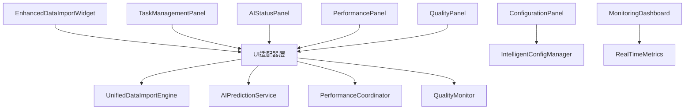

# Design Document

## Overview

本设计文档旨在系统化地增强DuckDB专业数据导入系统的UI功能，确保已开发的45项核心业务功能都能在UI中得到完整体现和操作。设计采用模块化架构，通过UI适配器模式连接业务逻辑与界面展示，实现功能完整性、用户体验优化和系统可维护性的统一。

## Steering Document Alignment

### Technical Standards (tech.md)
- 遵循PyQt5 UI框架标准和响应式设计原则
- 采用MVC架构模式，确保UI与业务逻辑分离
- 使用统一的主题管理和样式系统
- 实现组件化设计，最大化代码复用

### Project Structure (structure.md)
- UI组件放置在`gui/`目录下，按功能模块组织
- 业务逻辑适配器放置在`core/ui_integration/`目录
- 配置和样式文件统一管理
- 遵循现有的导入和依赖管理规范

## Code Reuse Analysis

### Existing Components to Leverage
- **EnhancedDataImportWidget**: 扩展现有的主UI组件，增加缺失的功能面板
- **ResponsiveLayoutManager**: 利用现有的响应式布局管理器
- **UnifiedThemeManager**: 使用统一主题管理系统
- **ModernUICoordinator**: 集成现代UI协调器功能
- **InteractionFeedbackSystem**: 利用交互反馈系统增强用户体验

### Integration Points
- **UnifiedDataImportEngine**: 通过UI适配器连接统一数据导入引擎
- **AIPredictionService**: 集成AI预测服务的UI展示
- **PerformanceCoordinator**: 连接性能监控系统
- **QualityMonitor**: 集成数据质量监控界面
- **TaskOrchestrationService**: 连接任务协调服务

## Architecture

采用分层架构设计，确保UI层、适配层和业务逻辑层的清晰分离：

### Modular Design Principles
- **UI组件模块化**: 每个功能区域独立为单独的UI组件
- **适配器模式**: 使用适配器连接UI与业务逻辑
- **事件驱动**: 通过信号槽机制实现组件间通信
- **状态管理**: 统一的状态管理和数据绑定



## Components and Interfaces

### UIBusinessLogicAdapter
- **Purpose:** 连接UI组件与业务逻辑，提供统一的数据访问接口
- **Interfaces:** 
  - `get_engine_status()` - 获取引擎状态
  - `get_ai_predictions()` - 获取AI预测结果
  - `get_performance_metrics()` - 获取性能指标
  - `execute_task(config)` - 执行导入任务
- **Dependencies:** 所有核心业务服务
- **Reuses:** 现有的服务容器和依赖注入机制

### EnhancedTaskManagementPanel
- **Purpose:** 提供完整的任务管理界面，包括创建、监控、依赖管理
- **Interfaces:**
  - `create_task_wizard()` - 任务创建向导
  - `show_dependency_graph()` - 依赖关系可视化
  - `update_task_status()` - 任务状态更新
- **Dependencies:** TaskOrchestrationService, DependencyResolver
- **Reuses:** 现有的任务配置组件

### AIFeaturesControlPanel
- **Purpose:** 集中展示和控制所有AI增强功能
- **Interfaces:**
  - `show_prediction_results()` - 显示预测结果
  - `configure_ai_settings()` - AI设置配置
  - `show_learning_progress()` - 学习进度展示
- **Dependencies:** AIPredictionService, UserBehaviorLearner, ConfigRecommendationEngine
- **Reuses:** 现有的AI服务组件

### PerformanceMonitoringDashboard
- **Purpose:** 实时性能监控和可视化展示
- **Interfaces:**
  - `update_metrics_display()` - 更新指标显示
  - `show_cache_status()` - 缓存状态展示
  - `display_distributed_nodes()` - 分布式节点状态
- **Dependencies:** UnifiedPerformanceCoordinator, IntelligentCacheCoordinator
- **Reuses:** 现有的性能监控组件

### DataQualityControlCenter
- **Purpose:** 数据质量监控和管理中心
- **Interfaces:**
  - `show_quality_metrics()` - 质量指标展示
  - `display_anomaly_alerts()` - 异常警报显示
  - `generate_quality_report()` - 生成质量报告
- **Dependencies:** UnifiedDataQualityMonitor, DataAnomalyDetector
- **Reuses:** 现有的质量监控组件

## Data Models

### UIStateModel
```python
@dataclass
class UIStateModel:
    - current_tab: str  # 当前活跃选项卡
    - task_list: List[TaskInfo]  # 任务列表
    - ai_status: AIStatusInfo  # AI状态信息
    - performance_metrics: PerformanceMetrics  # 性能指标
    - quality_status: QualityStatus  # 质量状态
    - user_preferences: UserPreferences  # 用户偏好
```

### TaskDisplayModel
```python
@dataclass
class TaskDisplayModel:
    - task_id: str  # 任务ID
    - name: str  # 任务名称
    - status: TaskStatus  # 任务状态
    - progress: float  # 进度百分比
    - dependencies: List[str]  # 依赖任务ID列表
    - estimated_time: Optional[datetime]  # 预计完成时间
    - performance_metrics: Dict[str, Any]  # 性能指标
```

### AIStatusModel
```python
@dataclass
class AIStatusModel:
    - prediction_accuracy: float  # 预测准确率
    - learning_progress: float  # 学习进度
    - active_models: List[str]  # 活跃模型列表
    - recommendations: List[ConfigRecommendation]  # 配置推荐
    - anomaly_alerts: List[AnomalyAlert]  # 异常警报
```

## Error Handling

### Error Scenarios
1. **业务逻辑服务不可用:**
   - **Handling:** 显示服务状态警告，提供重试机制
   - **User Impact:** 用户看到明确的服务状态提示和恢复建议

2. **AI服务响应超时:**
   - **Handling:** 降级到基础功能，后台重试AI服务连接
   - **User Impact:** 基础功能正常使用，AI功能暂时不可用提示

3. **性能数据获取失败:**
   - **Handling:** 使用缓存数据或默认值，记录错误日志
   - **User Impact:** 显示历史数据或估算值，标注数据时效性

4. **UI组件渲染异常:**
   - **Handling:** 组件级别的异常隔离，不影响其他功能
   - **User Impact:** 单个组件显示错误状态，其他功能正常

## Testing Strategy

### Unit Testing
- UI组件的独立功能测试
- 适配器层的数据转换测试
- 状态管理的逻辑测试
- 信号槽连接的正确性测试

### Integration Testing
- UI与业务逻辑的集成测试
- 多个UI组件间的交互测试
- 实时数据更新的端到端测试
- 主题切换和响应式布局测试

### End-to-End Testing
- 完整的用户操作流程测试
- 复杂任务的创建和执行测试
- AI功能的完整使用场景测试
- 系统在高负载下的UI响应测试

## Implementation Plan

### Phase 1: 核心适配器开发
1. 创建UIBusinessLogicAdapter基础框架
2. 实现与UnifiedDataImportEngine的连接
3. 建立基础的状态同步机制

### Phase 2: 任务管理UI增强
1. 扩展TaskManagementPanel功能
2. 实现依赖关系可视化
3. 添加任务优先级和调度控制

### Phase 3: AI功能UI集成
1. 开发AIFeaturesControlPanel
2. 集成预测结果展示
3. 实现智能配置推荐界面

### Phase 4: 性能监控完善
1. 增强PerformanceMonitoringDashboard
2. 实现实时指标更新
3. 添加缓存和分布式状态监控

### Phase 5: 质量管理中心
1. 完善DataQualityControlCenter
2. 实现异常检测可视化
3. 添加质量报告生成功能

### Phase 6: 整体优化和测试
1. 统一UI风格和交互体验
2. 性能优化和内存管理
3. 完整的测试套件执行
