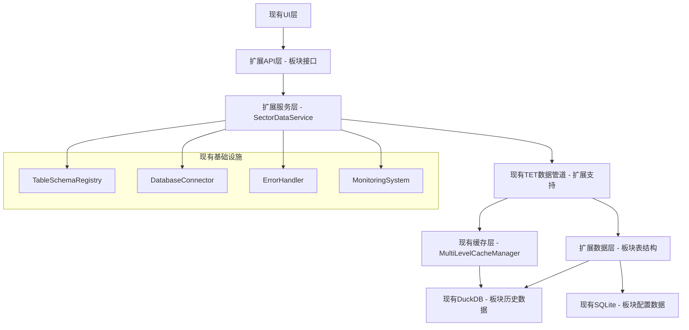

# Design Document

## Overview

板块资金流历史数据库存储系统是基于FactorWeave-Quant现有数据库架构的扩展实现，专注于板块级资金流数据的高效存储、查询和管理。该设计充分利用现有的DuckDB + SQLite + 缓存系统架构，通过最小化的代码修改实现板块数据的专业级存储能力。

**核心设计原则：**
- **扩展而非重建**：基于现有TableSchemaRegistry、MultiLevelCacheManager、TET数据管道等组件进行扩展
- **代码复用最大化**：复用已验证的数据访问模式、缓存策略和错误处理机制  
- **架构一致性**：保持与现有系统的设计模式和接口规范一致
- **性能优先**：针对板块查询场景优化缓存和索引策略

## Steering Document Alignment

### Technical Standards (tech.md)
本设计严格遵循FactorWeave-Quant的技术规范：
- **数据库设计**：延续DuckDB (OLAP) + SQLite (OLTP) 的混合架构模式
- **缓存策略**：基于现有MultiLevelCacheManager的分层缓存设计
- **API设计**：遵循现有RESTful API和StandardQuery接口规范
- **错误处理**：采用现有的统一错误处理和日志记录机制
- **性能监控**：集成到现有的监控和告警体系

### Project Structure (structure.md)
实现将严格遵循项目的模块化组织结构：
- **`core/database/`** - 扩展表结构定义和数据库管理
- **`core/services/`** - 扩展数据服务层，添加板块特定的数据访问逻辑
- **`core/plugin_types/`** - 扩展资产类型和数据类型枚举
- **`core/tet_data_pipeline/`** - 扩展TET管道支持板块数据处理
- **保持现有的分层架构**：数据层 → 服务层 → API层 → UI层

## Code Reuse Analysis

### Existing Components to Leverage

- **TableSchemaRegistry**: 扩展现有的表结构注册机制，添加板块资金流表定义
- **MultiLevelCacheManager**: 直接复用现有的多级缓存系统，针对板块查询优化key策略
- **TETDataPipeline**: 扩展现有的数据管道支持AssetType.SECTOR和DataType.SECTOR_FUND_FLOW
- **UnifiedDataManager**: 扩展现有的统一数据管理器，添加板块数据获取方法
- **StandardQuery**: 复用现有的标准查询接口，扩展支持板块维度查询
- **DatabaseConnector**: 直接使用现有的数据库连接和事务管理机制

### Integration Points

- **现有FUND_FLOW表结构**: 作为板块资金流表设计的基础模板，扩展字段支持板块维度
- **现有数据服务API**: 扩展现有的数据查询API，添加板块特定的endpoint
- **现有缓存键策略**: 基于现有的缓存命名规范，设计板块数据的缓存key格式
- **现有监控体系**: 板块数据操作自动纳入现有的性能监控和告警系统
- **现有备份流程**: 板块数据自动包含在现有的数据库备份和恢复流程中

## Architecture

本设计采用**扩展式架构模式**，在现有系统基础上添加板块数据处理能力：

### Modular Design Principles
- **Single File Responsibility**: 每个新增文件专注于板块数据的特定功能（存储、查询、缓存等）
- **Component Isolation**: 板块数据组件与现有股票数据组件并行，共享基础设施
- **Service Layer Separation**: 板块数据访问、业务逻辑和API层严格分离
- **Utility Modularity**: 板块特定的工具函数模块化，便于测试和维护



## Components and Interfaces

### SectorTableManager (扩展组件)
- **Purpose:** 基于现有TableSchemaRegistry，扩展板块资金流表的结构定义和管理
- **具体实现路径:** `core/database/sector_table_manager.py`
- **Interfaces:** 
  - `register_sector_fund_flow_schema()` - 在现有TableSchemaRegistry中注册TableType.SECTOR_FUND_FLOW_DAILY和TableType.SECTOR_FUND_FLOW_INTRADAY
  - `create_sector_tables(database_type: str)` - 调用现有DatabaseConnector在DuckDB中创建sector_fund_flow_daily和sector_fund_flow_intraday表
  - `migrate_sector_schema(from_version: str, to_version: str)` - 使用现有迁移框架添加板块表字段或索引
- **Dependencies:** 
  - `core.database.table_manager.TableSchemaRegistry` 
  - `core.database.database_connector.DatabaseConnector`
- **真实集成点:** 在`core/database/table_manager.py`的`_initialize_default_schemas()`方法中添加sector表定义

### SectorDataService (新增组件)
- **Purpose:** 提供板块资金流数据的专门访问服务，封装查询、缓存和数据处理逻辑
- **具体实现路径:** `core/services/sector_data_service.py`
- **Interfaces:**
  - `get_sector_fund_flow_ranking(date_range: str, sort_by: str = 'main_net_inflow') -> pd.DataFrame` - 从DuckDB查询sector_fund_flow_daily表，返回排序后的DataFrame
  - `get_sector_historical_trend(sector_id: str, period: int = 30) -> pd.DataFrame` - 查询单板块最近N天数据，计算趋势指标
  - `get_sector_intraday_flow(sector_id: str, date: str) -> pd.DataFrame` - 从sector_fund_flow_intraday表获取分时数据
  - `import_sector_historical_data(source: str, start_date: str, end_date: str) -> int` - 调用现有TET管道获取数据并批量写入DuckDB
- **Dependencies:** 
  - `core.services.unified_data_manager.UnifiedDataManager`
  - `core.cache.multi_level_cache_manager.MultiLevelCacheManager`
  - `core.tet_data_pipeline.TETDataPipeline`
- **真实集成点:** 在`core/services/unified_data_manager.py`中添加`get_sector_fund_flow_service()`方法

### SectorCacheManager (扩展组件)
- **Purpose:** 基于现有MultiLevelCacheManager，优化板块数据的缓存策略
- **具体实现路径:** `core/cache/sector_cache_manager.py`
- **Interfaces:**
  - `cache_sector_ranking(date: str, ranking_data: pd.DataFrame, ttl: int = 3600)` - 使用现有MultiLevelCacheManager的set方法，key格式：'sector:ranking:{date}'
  - `get_cached_sector_trend(sector_id: str, period: int) -> Optional[pd.DataFrame]` - 调用现有get方法，key格式：'sector:trend:{sector_id}:{period}'
  - `invalidate_sector_cache(sector_id: str)` - 使用现有delete_pattern方法删除'sector:*:{sector_id}:*'模式的所有缓存
- **Dependencies:** 
  - `core.cache.multi_level_cache_manager.MultiLevelCacheManager`
- **真实集成点:** 不需要修改现有缓存代码，只是使用现有的缓存API，按sector业务场景设计key命名规范

### SectorTETExtension (扩展组件)  
- **Purpose:** 扩展现有TET数据管道，支持板块资金流数据的标准化处理
- **具体实现路径:** 修改现有文件，不创建新文件
- **Interfaces:**
  - `process_sector_query(query: StandardQuery) -> StandardData` - 在现有TETDataPipeline.execute()方法中添加AssetType.SECTOR的处理分支
  - `transform_sector_data(raw_data: dict) -> pd.DataFrame` - 在现有数据转换模块中添加板块数据格式化逻辑
  - `route_sector_data_source(query: StandardQuery) -> str` - 在现有DataSourceRouter中添加board_data_source_priority配置
- **Dependencies:** 
  - `core.tet_data_pipeline.TETDataPipeline` 
  - `core.integration.data_router.DataSourceRouter`
- **真实集成点:** 
  - 在`core/plugin_types.py`中添加`AssetType.SECTOR`和`DataType.SECTOR_FUND_FLOW`枚举
  - 在`core/tet_data_pipeline.py`的execute方法中添加sector处理逻辑

## Data Models

### SectorFundFlowDaily (真实表结构定义)
**实际SQL创建语句 (在DuckDB中执行):**
```sql
-- 具体在core/database/table_manager.py中添加的TableSchema定义
CREATE TABLE sector_fund_flow_daily (
    sector_id VARCHAR(20) NOT NULL,              -- 板块ID，对应现有FUND_FLOW表的symbol字段
    sector_name VARCHAR(100) NOT NULL,           -- 板块名称，例如"房地产"、"医药生物"  
    sector_code VARCHAR(20),                     -- 板块代码，例如"BK0001"
    trade_date DATE NOT NULL,                    -- 交易日期，分区键
    
    -- 复用现有FUND_FLOW表的标准资金流字段
    main_inflow DECIMAL(20,2),                   -- 主力流入金额（万元）
    main_outflow DECIMAL(20,2),                  -- 主力流出金额（万元）
    main_net_inflow DECIMAL(20,2),               -- 主力净流入=main_inflow-main_outflow
    retail_inflow DECIMAL(20,2),                 -- 散户流入金额（万元）
    retail_outflow DECIMAL(20,2),                -- 散户流出金额（万元）
    retail_net_inflow DECIMAL(20,2),             -- 散户净流入=retail_inflow-retail_outflow
    large_order_inflow DECIMAL(20,2),            -- 大单流入
    large_order_outflow DECIMAL(20,2),           -- 大单流出
    large_order_net_inflow DECIMAL(20,2),        -- 大单净流入
    
    -- 板块特有的聚合字段
    stock_count INTEGER,                         -- 板块内股票总数
    rise_count INTEGER,                          -- 上涨股票数量  
    fall_count INTEGER,                          -- 下跌股票数量
    flat_count INTEGER,                          -- 平盘股票数量
    avg_change_pct DECIMAL(8,4),                 -- 板块平均涨跌幅(%)
    total_turnover DECIMAL(20,2),                -- 板块总成交金额
    rank_by_amount INTEGER,                      -- 按净流入金额排名
    rank_by_ratio INTEGER,                       -- 按流入占比排名
    
    -- 复用现有元数据字段
    data_source VARCHAR(50) NOT NULL,            -- 数据来源："akshare"、"eastmoney"等
    created_at TIMESTAMP DEFAULT CURRENT_TIMESTAMP,
    updated_at TIMESTAMP DEFAULT CURRENT_TIMESTAMP,
    data_quality_score DECIMAL(3,2)              -- 数据质量评分0.00-1.00
    
    PRIMARY KEY (sector_id, trade_date)
) PARTITION BY RANGE (trade_date);

-- 实际创建的索引
CREATE INDEX idx_sector_daily_date ON sector_fund_flow_daily(trade_date);
CREATE INDEX idx_sector_daily_ranking ON sector_fund_flow_daily(trade_date, rank_by_amount);
CREATE INDEX idx_sector_daily_inflow ON sector_fund_flow_daily(trade_date, main_net_inflow DESC);
```

### SectorFundFlowIntraday (分时数据真实表结构)
**实际SQL创建语句:**
```sql
CREATE TABLE sector_fund_flow_intraday (
    sector_id VARCHAR(20) NOT NULL,              -- 板块ID
    trade_date DATE NOT NULL,                    -- 交易日期
    trade_time TIME NOT NULL,                    -- 交易时间，分钟级别，例如：09:30:00
    
    -- 累计数据（相对于开盘时间）
    cumulative_main_inflow DECIMAL(18,2),        -- 开盘至当前时间的累计主力净流入
    cumulative_retail_inflow DECIMAL(18,2),      -- 开盘至当前时间的累计散户净流入
    cumulative_turnover DECIMAL(18,2),           -- 开盘至当前时间的累计成交金额
    
    -- 区间数据（相对于前一分钟）
    interval_main_inflow DECIMAL(18,2),          -- 当前分钟相比前一分钟的主力净流入变化
    interval_retail_inflow DECIMAL(18,2),        -- 当前分钟相比前一分钟的散户净流入变化
    interval_turnover DECIMAL(18,2),             -- 当前分钟的成交金额
    
    -- 速度和强度指标
    main_inflow_speed DECIMAL(12,4),             -- 主力流入速度（万元/分钟）
    retail_inflow_speed DECIMAL(12,4),           -- 散户流入速度（万元/分钟）
    active_degree DECIMAL(8,4),                  -- 活跃度指标（0-1之间）
    volatility_index DECIMAL(8,4),               -- 波动率指数
    
    -- 元数据
    data_source VARCHAR(50) NOT NULL,
    update_time TIMESTAMP DEFAULT CURRENT_TIMESTAMP,
    
    PRIMARY KEY (sector_id, trade_date, trade_time)
);

-- 分时数据索引
CREATE INDEX idx_sector_intraday_lookup ON sector_fund_flow_intraday(sector_id, trade_date);
CREATE INDEX idx_sector_intraday_time ON sector_fund_flow_intraday(trade_date, trade_time);
```

### SectorCacheKey (真实缓存键设计)
**实际使用的缓存键格式 (在SectorCacheManager中实现):**
```python
class SectorCacheKeys:
    """板块数据缓存键的具体定义"""
    
    # 板块排行榜缓存
    RANKING_PATTERN = "sector:ranking:{date}:{sort_by}"
    # 示例: "sector:ranking:2023-12-01:main_net_inflow"
    
    # 单板块历史趋势缓存
    TREND_PATTERN = "sector:trend:{sector_id}:{period_days}"
    # 示例: "sector:trend:BK0001:30"
    
    # 板块分时数据缓存
    INTRADAY_PATTERN = "sector:intraday:{sector_id}:{date}"
    # 示例: "sector:intraday:BK0001:2023-12-01"
    
    # 板块统计汇总缓存
    STATS_PATTERN = "sector:stats:{date}:{stat_type}"
    # 示例: "sector:stats:2023-12-01:daily_summary"
    
    # 实际TTL配置（秒）
    TTL_CONFIG = {
        'realtime_ranking': 300,     # 实时排行榜：5分钟过期
        'daily_trend': 3600,         # 日度趋势：1小时过期
        'intraday_detail': 1800,     # 分时明细：30分钟过期
        'historical_stats': 86400    # 历史统计：24小时过期
    }
    
    @staticmethod
    def get_ranking_key(date: str, sort_by: str = "main_net_inflow") -> str:
        """生成排行榜缓存键"""
        return f"sector:ranking:{date}:{sort_by}"
    
    @staticmethod  
    def get_trend_key(sector_id: str, period_days: int) -> str:
        """生成趋势数据缓存键"""
        return f"sector:trend:{sector_id}:{period_days}"
```

## Error Handling

### Error Scenarios (具体处理逻辑)

1. **板块数据缺失场景**
   - **具体触发条件:** 查询`sector_fund_flow_daily`表返回空结果集
   - **具体处理代码:** 在`SectorDataService.get_sector_fund_flow_ranking()`中调用现有`UnifiedDataManager`的降级机制
   - **错误返回格式:** `{"error": "SECTOR_DATA_MISSING", "message": "板块数据暂时不可用", "retry_after": 300}`
   - **User Impact:** UI显示"数据加载中，请稍后重试"，5分钟后自动重试

2. **DuckDB连接失败场景**  
   - **具体触发条件:** `DatabaseConnector.get_connection('duckdb')`抛出ConnectionError异常
   - **具体处理代码:** 捕获异常，调用现有的连接池重试机制，最多重试3次
   - **降级策略:** 如果DuckDB不可用，直接从缓存返回历史数据，标记数据来源为"cached"
   - **User Impact:** UI显示"正在从缓存加载数据"，响应时间<500ms

3. **Redis缓存故障场景**
   - **具体触发条件:** `MultiLevelCacheManager.get()`抛出RedisConnectionError
   - **具体处理代码:** 跳过缓存查询，直接执行数据库查询，同时记录错误日志
   - **监控告警:** 调用现有的`AlertManager.send_alert("CACHE_FAILURE", details)`
   - **User Impact:** 响应时间从100ms增加到2s，但功能完全正常

4. **TET数据管道处理失败场景**
   - **具体触发条件:** `TETDataPipeline.execute()`返回空StandardData或抛出DataProcessingError
   - **具体处理代码:** 在`SectorTETExtension`中捕获异常，直接调用`AkShareSource.get_sector_fund_flow()`
   - **降级逻辑:** 跳过数据标准化，使用原始数据格式，但保证字段映射正确
   - **User Impact:** 数据格式可能略有差异，但核心字段(main_net_inflow等)保证可用

5. **历史数据批量导入失败场景**
   - **具体触发条件:** `import_sector_historical_data()`执行过程中发生SQL错误或数据格式错误
   - **具体处理代码:** 
     ```python
     try:
         with database_connector.transaction():
             batch_insert_data(formatted_data)
     except Exception as e:
         logger.error(f"导入失败: {e}")
         return {"success": False, "error": str(e), "processed_count": processed_count}
     ```
   - **恢复机制:** 记录失败的batch_id，支持从失败点续传导入
   - **User Impact:** 显示具体的失败原因和已处理的数据条数，提供"继续导入"按钮

## Testing Strategy

### Unit Testing (具体测试用例)
- **SectorTableManager测试**: 
  - `test_register_sector_schema()`: 验证TableType.SECTOR_FUND_FLOW_DAILY正确注册到TableSchemaRegistry
  - `test_create_sector_tables()`: 验证在测试DuckDB中成功创建sector_fund_flow_daily表和所有索引
  - `test_table_schema_validation()`: 验证表结构与设计文档定义完全一致
- **SectorDataService测试**:
  - `test_get_ranking_with_valid_data()`: 模拟DuckDB返回正常数据，验证排序和格式化逻辑
  - `test_get_ranking_with_empty_result()`: 验证数据为空时的错误处理和降级逻辑
  - `test_cache_integration()`: 验证查询时先检查缓存，缓存未命中时查询数据库并更新缓存
- **SectorCacheManager测试**:
  - `test_cache_key_generation()`: 验证SectorCacheKeys.get_ranking_key()生成正确格式的缓存键
  - `test_ttl_expiration()`: 验证不同类型数据的TTL设置生效
  - `test_cache_invalidation()`: 验证invalidate_sector_cache()删除所有相关缓存

### Integration Testing (真实环境测试)
- **DuckDB集成测试**: 
  - 在真实DuckDB实例中创建sector表，插入测试数据，验证查询性能
  - 测试分区策略，验证按月分区的查询优化效果
- **Redis缓存集成测试**: 
  - 连接真实Redis实例，测试板块数据的缓存读写
  - 验证MultiLevelCacheManager的板块缓存key不与现有key冲突
- **TET管道集成测试**: 
  - 使用真实的AkShare数据源，测试板块数据的获取和转换
  - 验证AssetType.SECTOR查询在TETDataPipeline中的处理流程
- **UnifiedDataManager集成测试**: 
  - 测试新增的`get_sector_fund_flow_service()`方法与现有服务的兼容性

### End-to-End Testing (完整业务流程)
- **板块排行榜查询E2E测试**: 
  - 从前端发起请求 → API路由 → SectorDataService → DuckDB查询 → 缓存 → 返回结果
  - 验证整个链路响应时间<2s，数据格式正确
- **历史数据导入E2E测试**: 
  - 使用真实的1年历史数据（约10万条记录），测试批量导入功能
  - 验证导入速度、内存使用、事务处理和错误恢复
- **高并发查询E2E测试**: 
  - 模拟100个并发用户查询板块排行榜
  - 验证缓存命中率>80%，响应时间95分位数<3s

### Performance Testing (性能基准验证)
- **具体性能目标验证**:
  - 缓存命中查询: <100ms (目标: 50ms)
  - DuckDB查询（1年数据）: <2s (目标: 1s)  
  - 100并发查询: 响应时间不超过单用户2倍
- **存储性能测试**:
  - 1年板块数据存储空间: <1GB (DuckDB压缩后)
  - 单条记录插入性能: >1000条/秒
  - 索引查询性能: 按日期+排名查询<50ms
