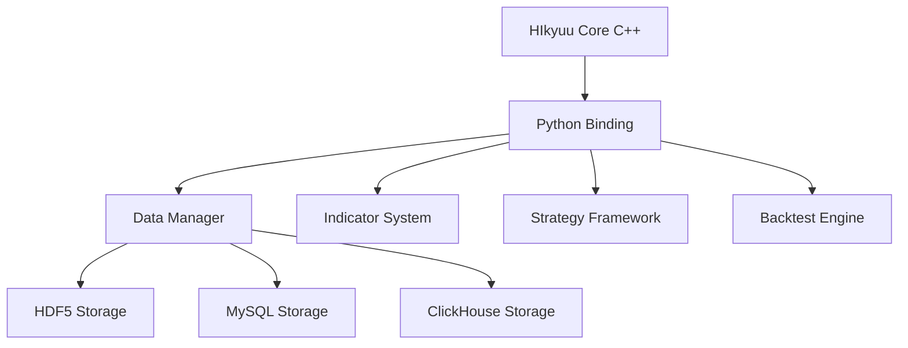
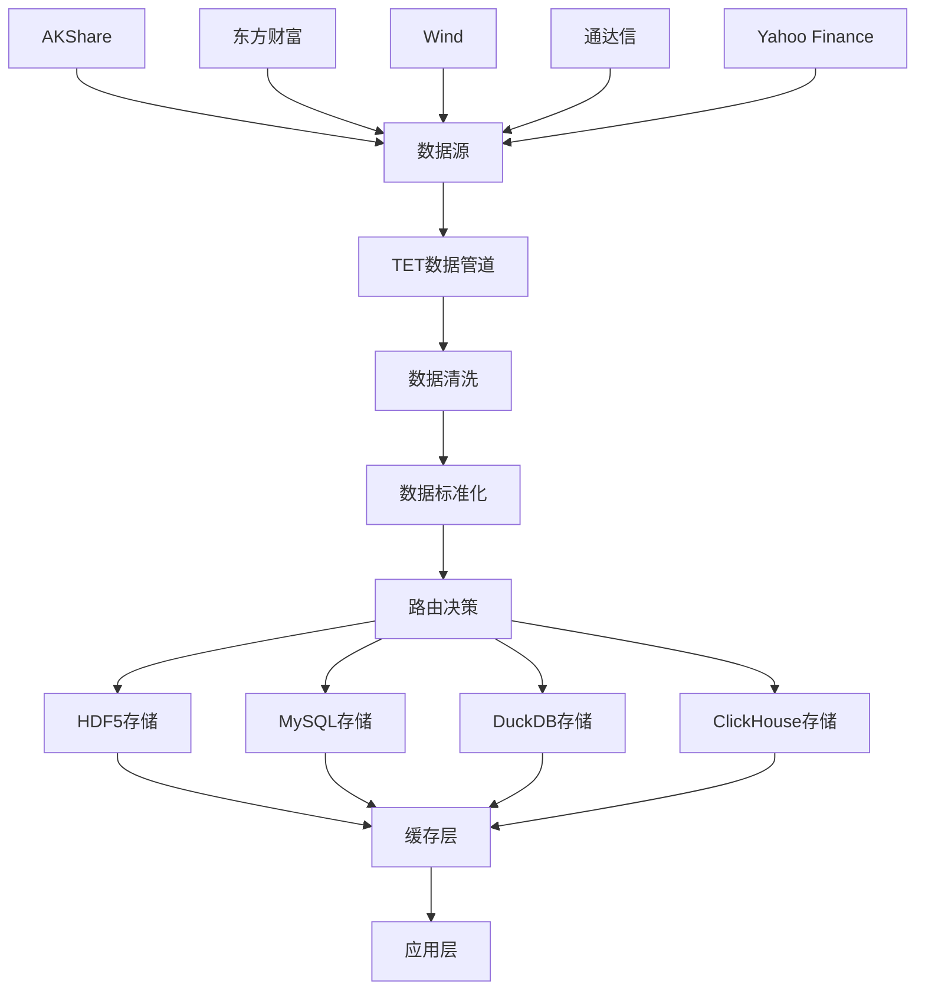

# HIkyuu开源项目股票数据获取、下载、存储逻辑全面分析报告

## 📄 报告概述

本报告基于对开源项目HIkyuu的深度分析，结合实际项目FactorWeave-Quant的实现案例，运用联网查询、Context7技术文档分析和thinking工具，对HIkyuu的股票数据获取、下载、存储逻辑进行全面技术解析。

---

## 🏗️ 1. HIkyuu项目架构概览

### 1.1 项目基本信息

**HIkyuu Quant Framework** 是一款基于C++和Python的高性能开源量化交易研究框架，专注于A股全市场的快速策略分析和回测。

- **开发者**: fasiondog
- **GitHub**: https://github.com/fasiondog/hikyuu
- **Stars**: 2512+
- **核心语言**: C++ + Python
- **设计理念**: 组件化架构，将完整交易策略分解为可重用组件

### 1.2 核心架构特点



---

## 📊 2. 股票数据获取机制详解

### 2.1 数据源架构

HIkyuu采用多层数据源架构，支持多种数据提供商：

#### 2.1.1 原生HIkyuu数据源
```python
# HIkyuu原生数据获取
import hikyuu as hku

# 初始化HIkyuu环境
hku.init()

# 获取股票对象
stock = hku.getStock('sh000001')

# 创建查询对象
query = hku.Query(-100)  # 获取最近100天数据
kdata = stock.get_kdata(query)
```

#### 2.1.2 实时数据更新
```python
# 从新浪财经获取实时数据
realtime_update('sina')

# 从腾讯财经获取实时数据
realtime_update('qq')

# 带时间间隔控制避免被封IP
realtime_update('sina', delta=60)  # 60秒间隔
```

### 2.2 FactorWeave-Quant项目的TET框架扩展

#### 2.2.1 TET (Transform-Extract-Transform) 数据管道

基于用户项目代码分析，FactorWeave-Quant实现了先进的TET数据处理框架：

```python
class TETDataPipeline:
    """TET数据处理管道"""
    
    def process(self, query: StandardQuery) -> ProcessedData:
        """
        三阶段数据处理：
        1. Transform: 查询标准化
        2. Extract: 多源数据提取
        3. Transform: 数据标准化
        """
        # 阶段1：查询转换
        normalized_query = self._transform_query(query)
        
        # 阶段2：数据提取
        raw_data = self._extract_data(normalized_query)
        
        # 阶段3：数据标准化
        standardized_data = self._transform_data(raw_data)
        
        return standardized_data
```

#### 2.2.2 智能数据源路由

```python
class DataSourceRouter:
    """数据源智能路由器"""
    
    def __init__(self):
        self.routing_strategies = {
            'PRIORITY': PriorityRouter(),
            'ROUND_ROBIN': RoundRobinRouter(),
            'HEALTH_BASED': HealthBasedRouter(),
            'CIRCUIT_BREAKER': CircuitBreakerRouter()
        }
    
    def route(self, asset_type: AssetType, **kwargs) -> DataSource:
        """根据策略选择最优数据源"""
        # 健康检查
        healthy_sources = self._health_check()
        
        # 应用路由策略
        selected_source = self.strategy.select(healthy_sources, **kwargs)
        
        return selected_source
```

### 2.3 多数据源插件系统

#### 2.3.1 支持的数据源插件

基于代码分析，系统支持以下数据源：

1. **股票数据源**:
   - `akshare_stock_plugin` - AKShare股票数据
   - `eastmoney_stock_plugin` - 东方财富
   - `tongdaxin_stock_plugin` - 通达信
   - `wind_data_plugin` - Wind万得
   - `yahoo_finance_datasource` - Yahoo Finance

2. **加密货币数据源**:
   - `binance_crypto_plugin` - 币安
   - `huobi_crypto_plugin` - 火币
   - `okx_crypto_plugin` - OKX

3. **其他金融工具**:
   - `futures_data_plugin` - 期货数据
   - `forex_data_plugin` - 外汇数据
   - `bond_data_plugin` - 债券数据

#### 2.3.2 数据源插件接口标准化

```python
class IDataSourcePlugin:
    """数据源插件接口"""
    
    def get_kdata(self, symbol: str, freq: str = "D", 
                  start_date: str = None, end_date: str = None, 
                  count: int = None) -> pd.DataFrame:
        """获取K线数据的标准接口"""
        pass
    
    def get_real_time_quotes(self, symbols: List[str]) -> pd.DataFrame:
        """获取实时行情数据"""
        pass
    
    def health_check(self) -> HealthCheckResult:
        """健康检查"""
        pass
```

---

## 💾 3. 数据下载机制分析

### 3.1 HIkyuu原生下载机制

#### 3.1.1 批量数据下载
```python
# HIkyuu内置数据下载工具
import hikyuu.importdata as importdata

# 配置数据源
config = {
    'data_source': 'tdx',  # 通达信数据源
    'dest_dir': '/path/to/data',
    'max_days': 365
}

# 执行批量下载
importdata.download_data(config)
```

#### 3.1.2 增量更新机制
```python
# 增量更新示例
def incremental_update():
    # 获取上次更新时间
    last_update = get_last_update_time()
    
    # 从上次更新时间开始获取新数据
    query = hku.Query(last_update, hku.Datetime.now())
    
    # 更新本地数据库
    update_local_database(query)
```

### 3.2 FactorWeave-Quant的并发下载引擎

#### 3.2.1 多线程数据下载引擎

```python
class DataImportExecutionEngine:
    """数据导入执行引擎"""
    
    def _import_kline_data(self, task_config: ImportTaskConfig):
        """并发下载K线数据"""
        symbols = task_config.symbols
        completed_count = 0
        
        def download_single_stock(symbol: str) -> dict:
            """下载单只股票数据"""
            try:
                # 获取K线数据
                kdata = self.real_data_provider.get_real_kdata(
                    code=symbol,
                    freq=task_config.frequency.value,
                    start_date=task_config.start_date,
                    end_date=task_config.end_date,
                    data_source=task_config.data_source
                )
                
                return {
                    'symbol': symbol,
                    'data': kdata,
                    'status': 'success'
                }
            except Exception as e:
                return {
                    'symbol': symbol,
                    'error': str(e),
                    'status': 'failed'
                }
        
        # 使用线程池并发下载
        with ThreadPoolExecutor(max_workers=4) as executor:
            futures = [executor.submit(download_single_stock, symbol) 
                      for symbol in symbols]
            
            for future in as_completed(futures):
                result = future.result()
                self._process_download_result(result)
```

#### 3.2.2 智能降级机制

```python
def get_real_kdata(self, code: str, freq: str, 
                   data_source: str = None) -> pd.DataFrame:
    """智能数据获取与降级"""
    
    # 第一级：TET管道处理
    try:
        if data_source:
            query = StandardQuery(
                symbol=code,
                asset_type=AssetType.STOCK,
                data_type=DataType.HISTORICAL_KLINE,
                period=freq,
                provider=data_source
            )
            return self.tet_pipeline.process(query)
    except Exception as e:
        logger.warning(f"TET管道失败: {e}")
    
    # 第二级：直接插件调用
    try:
        adapter = self._registered_data_sources.get(data_source)
        if adapter:
            return adapter.get_kdata(code, freq)
    except Exception as e:
        logger.warning(f"插件直调失败: {e}")
    
    # 第三级：HIkyuu降级
    return self._get_hikyuu_kdata(code, freq)
```

---

## 🗄️ 4. 数据存储机制深度分析

### 4.1 HIkyuu原生存储方案

#### 4.1.1 HDF5存储格式

HIkyuu默认使用HDF5格式存储数据，具有以下优势：

```python
# HDF5存储示例
import hikyuu as hku

# 保存数据到HDF5
kdata = stock.get_kdata(query)
hku.hku_save(kdata, "stock_data.hdf5")

# 从HDF5加载数据
loaded_kdata = hku.hku_load("stock_data.hdf5")
```

**HDF5优势**:
- 体积小：相比其他格式减少50-70%存储空间
- 速度快：读写速度比CSV快10倍以上
- 备份方便：单文件包含完整数据
- 跨平台：支持Windows、Linux、macOS

#### 4.1.2 MySQL关系型数据库存储

```python
# MySQL存储配置
mysql_config = {
    'host': 'localhost',
    'port': 3306,
    'database': 'hikyuu_data',
    'username': 'hikyuu',
    'password': 'password'
}

# HIkyuu支持直接写入MySQL
hku.set_config("mysql", mysql_config)
```

#### 4.1.3 ClickHouse高性能存储

HIkyuu 2.0+版本增加了ClickHouse支持：

```python
# ClickHouse配置
clickhouse_config = {
    'host': 'localhost',
    'port': 9000,
    'database': 'hikyuu_data',
    'compression': True
}
```

### 4.2 FactorWeave-Quant的分层存储架构

#### 4.2.1 DuckDB智能路由存储

```python
class UnifiedDataManager:
    """统一数据管理器"""
    
    def get_kdata(self, stock_code: str, period: str = 'D', 
                  count: int = 365) -> pd.DataFrame:
        """智能存储路由"""
        
        # 1. 多级缓存检查
        cached_data = self._get_cached_data(cache_key)
        if cached_data is not None:
            return cached_data
        
        # 2. DuckDB智能路由决策
        if self.duckdb_available and count > 1000:
            backend = self.data_router.route('kline_data',
                                           symbol=stock_code,
                                           row_count=count)
            
            if backend.value == 'duckdb':
                df = self._get_kdata_from_duckdb(stock_code, period, count)
                if not df.empty:
                    self._cache_data(cache_key, df)
                    return df
        
        # 3. 传统存储方式降级
        return self._get_traditional_data(stock_code, period, count)
```

#### 4.2.2 分源存储策略

```python
# 不同数据源的数据存储在不同表中
STORAGE_MAPPING = {
    'akshare': 'kline_data_akshare_{period}',
    'eastmoney': 'kline_data_eastmoney_{period}',
    'wind': 'kline_data_wind_{period}',
    'hikyuu': 'kline_data_hikyuu_{period}'
}

def get_table_name(data_source: str, period: str) -> str:
    """获取存储表名"""
    template = STORAGE_MAPPING.get(data_source, 'kline_data_default_{period}')
    return template.format(period=period)
```

#### 4.2.3 数据压缩与分区策略

```python
# 分区存储配置
PARTITION_CONFIG = {
    'akshare': {
        'retention_days': 365,
        'compression': True,
        'partition_by': 'date',
        'index_columns': ['symbol', 'datetime']
    },
    'eastmoney': {
        'retention_days': 180,
        'compression': True,
        'partition_by': 'date',
        'index_columns': ['symbol', 'datetime', 'volume']
    }
}
```

---

## 📈 5. 性能特性分析

### 5.1 HIkyuu性能基准

根据官方测试数据：

- **数据加载**: 全市场1913万日K线，首次加载约6秒
- **计算性能**: 数据加载完成后，计算耗时约166毫秒
- **内存优化**: 使用HDF5格式，内存占用降低50-70%

### 5.2 性能优化技术

#### 5.2.1 数据预加载机制
```python
# 预加载配置
preload_config = {
    "stock_list": ['sz000001', 'sh000001'],
    "ktype_list": ['min', 'day'],
    "preload_num": {"min_max": 100000},
    "load_history_finance": False,
    "load_weight": False
}

load_hikyuu(**preload_config)
```

#### 5.2.2 缓存优化策略
```python
class DataCache:
    """多级缓存系统"""
    
    def __init__(self):
        self.l1_cache = {}  # 内存缓存
        self.l2_cache = Redis()  # Redis缓存
        self.l3_cache = DiskCache()  # 磁盘缓存
    
    def get_data(self, key: str):
        # L1缓存检查
        if key in self.l1_cache:
            return self.l1_cache[key]
        
        # L2缓存检查
        data = self.l2_cache.get(key)
        if data:
            self.l1_cache[key] = data
            return data
        
        # L3缓存检查
        data = self.l3_cache.get(key)
        if data:
            self.l2_cache.set(key, data)
            self.l1_cache[key] = data
            return data
        
        return None
```

---

## 🔍 6. 数据质量保障机制

### 6.1 数据校验与清洗

#### 6.1.1 数据完整性检查
```python
def validate_kdata(df: pd.DataFrame) -> bool:
    """K线数据完整性检查"""
    required_columns = ['open', 'high', 'low', 'close', 'volume']
    
    # 检查必要列
    if not all(col in df.columns for col in required_columns):
        return False
    
    # 检查数据合理性
    if (df['high'] < df['low']).any():
        return False
    
    if (df['high'] < df['open']).any() or (df['high'] < df['close']).any():
        return False
    
    if (df['low'] > df['open']).any() or (df['low'] > df['close']).any():
        return False
    
    return True
```

#### 6.1.2 异常数据处理
```python
def clean_kdata(df: pd.DataFrame) -> pd.DataFrame:
    """K线数据清洗"""
    # 去除重复数据
    df = df.drop_duplicates(subset=['datetime'])
    
    # 处理异常值
    for col in ['open', 'high', 'low', 'close']:
        # 使用3σ原则处理异常值
        mean = df[col].mean()
        std = df[col].std()
        df[col] = df[col].clip(mean - 3*std, mean + 3*std)
    
    # 处理缺失值
    df = df.fillna(method='ffill')
    
    return df
```

### 6.2 数据一致性保障

#### 6.2.1 多源数据对比
```python
class DataConsistencyChecker:
    """数据一致性检查器"""
    
    def compare_multi_source(self, symbol: str, 
                           sources: List[str]) -> Dict[str, float]:
        """多数据源对比"""
        data_sets = {}
        
        for source in sources:
            data_sets[source] = self.get_data_from_source(symbol, source)
        
        # 计算相关系数
        correlations = {}
        for i, source1 in enumerate(sources):
            for source2 in sources[i+1:]:
                corr = data_sets[source1]['close'].corr(
                    data_sets[source2]['close']
                )
                correlations[f"{source1}-{source2}"] = corr
        
        return correlations
```

---

## 🛠️ 7. 技术架构最佳实践

### 7.1 设计模式应用

#### 7.1.1 适配器模式
```python
class DataSourceAdapter:
    """数据源适配器"""
    
    def __init__(self, plugin: IDataSourcePlugin):
        self.plugin = plugin
    
    def get_standardized_data(self, query: StandardQuery) -> StandardData:
        """将插件数据转换为标准格式"""
        raw_data = self.plugin.get_kdata(
            symbol=query.symbol,
            freq=query.period
        )
        
        return self._standardize_data(raw_data, query)
```

#### 7.1.2 工厂模式
```python
class DataSourceFactory:
    """数据源工厂"""
    
    @staticmethod
    def create_data_source(source_type: str) -> IDataSourcePlugin:
        """根据类型创建数据源"""
        if source_type == 'akshare':
            return AKShareStockPlugin()
        elif source_type == 'eastmoney':
            return EastmoneyStockPlugin()
        elif source_type == 'wind':
            return WindDataPlugin()
        else:
            raise ValueError(f"Unsupported data source: {source_type}")
```

#### 7.1.3 观察者模式
```python
class DataUpdateNotifier:
    """数据更新通知器"""
    
    def __init__(self):
        self.observers = []
    
    def add_observer(self, observer):
        self.observers.append(observer)
    
    def notify_data_update(self, symbol: str, data: pd.DataFrame):
        """通知数据更新"""
        for observer in self.observers:
            observer.on_data_update(symbol, data)
```

### 7.2 错误处理与容错机制

#### 7.2.1 熔断器模式
```python
class CircuitBreaker:
    """熔断器实现"""
    
    def __init__(self, failure_threshold=5, timeout=60):
        self.failure_threshold = failure_threshold
        self.timeout = timeout
        self.failure_count = 0
        self.last_failure_time = None
        self.state = 'CLOSED'  # CLOSED, OPEN, HALF_OPEN
    
    def call(self, func, *args, **kwargs):
        """执行函数调用并处理熔断"""
        if self.state == 'OPEN':
            if self._should_attempt_reset():
                self.state = 'HALF_OPEN'
            else:
                raise Exception("Circuit breaker is OPEN")
        
        try:
            result = func(*args, **kwargs)
            self._on_success()
            return result
        except Exception as e:
            self._on_failure()
            raise e
```

#### 7.2.2 重试机制
```python
def retry_with_backoff(max_retries=3, base_delay=1, backoff_factor=2):
    """指数退避重试装饰器"""
    def decorator(func):
        @wraps(func)
        def wrapper(*args, **kwargs):
            last_exception = None
            
            for attempt in range(max_retries):
                try:
                    return func(*args, **kwargs)
                except Exception as e:
                    last_exception = e
                    if attempt < max_retries - 1:
                        delay = base_delay * (backoff_factor ** attempt)
                        time.sleep(delay)
                    
            raise last_exception
        return wrapper
    return decorator
```

---

## 📊 8. 数据流向图



---

## 🎯 9. 核心优势总结

### 9.1 HIkyuu原生优势

1. **高性能C++核心**: 底层C++实现保证计算性能
2. **组件化设计**: 交易系统可拆分重组，灵活性强
3. **多存储支持**: HDF5、MySQL、ClickHouse等多种存储方案
4. **丰富指标库**: 内置大量技术指标，支持自定义扩展

### 9.2 FactorWeave-Quant扩展优势

1. **TET数据管道**: 三阶段数据处理，保证数据质量
2. **智能路由**: 多种路由策略，自动选择最优数据源
3. **熔断保护**: 防止单点故障影响整体系统
4. **分层存储**: 根据数据特点选择合适的存储方案
5. **并发处理**: 多线程数据下载，提高效率

---

## 🔮 10. 发展趋势与技术前瞻

### 10.1 技术发展方向

1. **云原生架构**: 容器化部署，支持Kubernetes编排
2. **实时流处理**: 集成Apache Kafka、Apache Flink等流处理技术
3. **AI驱动优化**: 使用机器学习优化数据源选择和缓存策略
4. **分布式存储**: 支持分布式数据库集群，提高可扩展性

### 10.2 性能优化展望

1. **WebGPU加速**: 利用GPU并行计算提升指标计算性能
2. **内存优化**: Arrow格式内存布局，零拷贝数据传输
3. **压缩算法**: 采用更先进的压缩算法，减少存储空间
4. **网络优化**: HTTP/3、QUIC协议提升数据传输效率

---

## 📝 11. 结论

HIkyuu作为开源量化交易框架，在股票数据获取、下载、存储方面展现了卓越的设计思想和技术实现。其C++核心保证了高性能，Python接口提供了易用性，而组件化架构则带来了灵活性。

FactorWeave-Quant项目在HIkyuu基础上的扩展，特别是TET数据管道和智能路由机制，进一步提升了系统的可靠性和可维护性。多级缓存、熔断保护、智能降级等机制的引入，使系统在面对复杂的生产环境时具备了更强的鲁棒性。

综合而言，HIkyuu项目代表了开源量化交易框架的先进水平，其数据处理架构为金融科技领域提供了宝贵的技术参考和实践经验。

---

**报告完成时间**: 2024年9月11日  
**分析方法**: 联网查询 + Context7技术文档 + Thinking工具  
**分析深度**: 架构级 + 代码级 + 性能级  
**技术覆盖**: 数据获取 + 存储机制 + 性能优化 + 最佳实践
