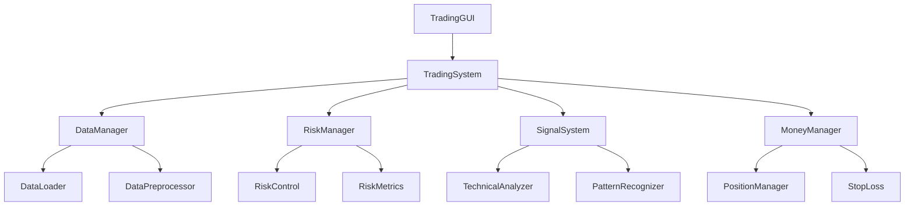

# Hikyuu 量化交易系统
#注意：后续有新功能涉及多线程/定时器/UI更新，务必继续采用"信号/槽+主线程UI更新"模式：使用 pyqtSignal 和 pyqtSlot
   所有QWidget及其子类（如QTableWidgetItem）必须在主线程创建和操作。
   子线程只做数据计算，结果通过信号发回主线程，由主线程更新UI。
   后续有自定义指标或新UI组件，务必统一用self.main_layout管理布局，避免直接用self.layout。
   若有新指标或趋势分析方法，参考上述兼容写法，优先判断数据类型，保证健壮性
   有新增分析Tab或按钮，均建议统一用set_kdata同步数据，内部分析逻辑统一用self.current_kdata，避免多处维护
   在 gui/dialogs/db_field_permissions.json 中配置字段权限（如 \"readonly\"、\"hidden\"）。
   “批量修改”对话框支持条件筛选，操作更安全高效。
   只读字段在所有编辑场景下均不可更改，数据安全有保障。
体验方法
   在“字段权限管理”对话框中，点击“上传权限到云端”或“从云端拉取权限”即可同步配置。
   点击“查看权限变更日志”可浏览所有权限变更历史。
   注意：
   云端API地址需替换为你实际的企业API或云存储接口。
   权限日志和配置均为json格式，便于二次开发和自动化集成
   
## 系统概述
Hikyuu量化交易系统是一个功能完整的量化交易平台，支持策略开发、回测、实盘交易等功能。系统采用Python编写，具有良好的可扩展性和易用性。

## 核心类调用关系



### 主要类说明

1. TradingGUI (main.py)
   - 系统主窗口
   - 负责UI交互和事件处理
   - 调用TradingSystem执行交易操作

2. TradingSystem (core/trading_system.py)
   - 交易系统核心
   - 协调各个子系统工作
   - 处理交易逻辑

3. DataManager (core/data_manager.py)
   - 数据管理
   - 处理数据获取和存储
   - 提供数据访问接口

4. RiskManager (core/risk_manager.py)
   - 风险管理
   - 执行风险控制
   - 计算风险指标

5. SignalSystem (core/signal_system.py)
   - 信号系统
   - 生成交易信号
   - 处理信号过滤

### 数据流

1. 数据获取流程
   ```
   DataManager -> DataLoader -> DataPreprocessor -> TradingSystem
   ```

2. 信号生成流程
   ```
   TechnicalAnalyzer -> PatternRecognizer -> SignalSystem -> TradingSystem
   ```

3. 交易执行流程
   ```
   TradingSystem -> RiskManager -> MoneyManager -> PositionManager
   ```

## 配置说明

系统配置文件位于 config/ 目录下：
- config.json: 主配置文件
- logging.json: 日志配置
- theme.json: 主题配置
- performance.json: （已移除性能监控弹窗和相关功能，右下角CPU/内存展示保留）配置

## 开发指南

详细的开发文档请参考 [docs/development.md](docs/development.md)。

### 开发规范

1. 代码风格
   - 遵循PEP 8
   - 使用类型提示
   - 编写详细的文档字符串

2. 错误处理
   - 使用异常处理
   - 记录详细日志
   - 提供用户友好的错误提示

3. 性能优化
   - 使用缓存
   - 优化算法
   - 监控系统性能

## 依赖项

详见 requirements.txt

## 启动说明

1. 安装依赖：
   ```bash
   pip install -r requirements.txt
   ```

2. 运行程序：
   ```bash
   python main.py
   ```

## 注意事项

1. 首次运行需要初始化配置
2. 建议使用虚拟环境
3. 需要Python 3.8+

## 许可证

MIT License

## 功能特点

- 完整的K线图显示和技术分析功能
- 多种技术指标支持（MA、MACD、KDJ、RSI等）
- 实时市场数据和行情显示
- 自定义策略编写和回测
- （已移除性能监控弹窗和相关功能，右下角CPU/内存展示保留）和优化
- 市场情绪分析
- 资金流向分析
- 主题切换支持

## 系统要求

- Python 3.7+
- Hikyuu 2.5.6+
- PyQt5 5.15.0+
- 其他依赖见 requirements.txt

## 安装说明

1. 克隆仓库：
```bash
git clone https://github.com/yourusername/hikyuu-ui.git
cd hikyuu-ui
```

2. 安装依赖：
```bash
pip install -r requirements.txt
```

3. 运行程序：
```bash
python main.py
```

## 配置说明

系统配置通过 `config.json` 文件管理，包括以下主要配置项：

- 主题配置：背景色、文字颜色、网格颜色等
- 图表配置：是否显示网格、自动更新、默认周期等
- 交易配置：手续费、滑点、初始资金等
- 性能配置：（已移除性能监控弹窗和相关功能，右下角CPU/内存展示保留）阈值、日志级别等
- UI配置：窗口大小、字体大小等
- 数据配置：数据源、缓存大小等

配置文件示例：
```json
{
    "theme": {
        "name": "light",
        "background_color": "#FFFFFF",
        "text_color": "#000000",
        "grid_color": "#E0E0E0",
        "chart_colors": ["#1F77B4", "#FF7F0E", "#2CA02C", "#D62728"]
    },
    "chart": {
        "show_grid": true,
        "auto_update": true,
        "update_interval": 5,
        "default_period": "D",
        "default_indicators": ["MA", "MACD", "RSI"]
    }
}
```

## 项目结构

```
hikyuu-ui/
├── main.py              # 主程序入口
├── requirements.txt     # 依赖配置
├── config.json         # 配置文件
├── utils/
│   ├── __init__.py
│   ├── config_manager.py   # 配置管理
│   ├── theme.py           # 主题管理
│   ├── performance_monitor.py  # （已移除性能监控弹窗和相关功能，右下角CPU/内存展示保留）
│   └── log_manager.py     # 日志管理
└── resources/          # 资源文件
    ├── images/
    └── themes/
```

## 使用说明

1. 股票查询和选择
   - 在左侧搜索框输入股票代码或名称
   - 双击选择股票查看详情

2. 技术分析
   - 支持多种技术指标
   - 可自定义指标参数
   - 支持叠加多个指标

3. 策略回测
   - 支持自定义策略编写
   - 提供策略模板
   - 详细的回测报告

4. 实时监控
   - 市场情绪分析
   - 资金流向分析
   - （已移除性能监控弹窗和相关功能，右下角CPU/内存展示保留）

## 开发说明

1. 代码规范
   - 遵循 PEP 8 规范
   - 使用类型提示
   - 详细的文档注释

2. 性能优化
   - 使用缓存机制
   - 异步处理
   - （已移除性能监控弹窗和相关功能，右下角CPU/内存展示保留）和优化

3. 错误处理
   - 统一的异常处理
   - 详细的日志记录
   - 用户友好的错误提示

## 贡献指南

1. Fork 项目
2. 创建特性分支
3. 提交更改
4. 推送到分支
5. 创建 Pull Request

## 联系方式

- 项目主页：https://github.com/yourusername/hikyuu-ui
- 问题反馈：https://github.com/yourusername/hikyuu-ui/issues

## 系统架构

该交易系统遵循Hikyuu量化框架的设计理念，将交易系统拆分为多个独立组件：

- **信号指示器(Signal)**: 负责产生买入和卖出信号
- **资金管理(Money Manager)**: 决定每次交易的资金分配和头寸规模
- **止损策略(Stop Loss)**: 控制单笔交易的最大风险
- **止盈策略(Take Profit)**: 设定获利目标和退出条件
- **市场环境判断(Environment)**: 评估当前市场状态是否适合交易
- **系统有效条件(Condition)**: 确定交易系统是否处于有效状态
- **移滑价差算法(Slippage)**: 模拟实际交易中的价格滑点
- **交易成本(Trade Cost)**: 计算交易佣金和税费

## 目录结构

```
合适的买卖点/
├── backtest/                 # 回测相关组件
│   ├── backtest_engine.py    # 回测引擎实现
│   └── performance_metrics.py # 性能评估指标计算
├── core/                     # 核心组件
│   ├── adaptive_stop_loss.py # 自适应止损策略
│   ├── market_environment.py # 市场环境判断
│   ├── money_manager.py      # 资金管理策略
│   ├── money/                # 资金管理子组件
│   ├── risk_alert.py         # 风险预警
│   ├── risk_control.py       # 风险控制
│   ├── risk_exporter.py      # 风险数据导出
│   ├── risk_metrics.py       # 风险指标计算
│   ├── risk/                 # 风险管理子组件
│   ├── signal.py             # 信号生成基类
│   ├── signal_system.py      # 信号系统
│   ├── signal/               # 信号生成子组件
│   ├── stop_loss.py          # 止损策略
│   ├── system_condition.py   # 系统有效条件
│   ├── system/               # 系统集成子组件
│   ├── take_profit.py        # 止盈策略
│   ├── trading_controller.py # 交易控制器
│   └── templates/            # 组件模板
├── data/                     # 数据处理相关
│   ├── data_loader.py        # 数据加载
│   └── data_preprocessing.py # 数据预处理
├── evaluation/               # 策略评估
├── features/                 # 特征工程
│   ├── advanced_indicators.py # 高级技术指标
│   ├── basic_indicators.py   # 基础技术指标
│   └── feature_selection.py  # 特征选择方法
├── models/                   # 机器学习模型
│   ├── deep_learning.py      # 深度学习模型
│   ├── model_evaluation.py   # 模型评估
│   └── model_training.py     # 模型训练
├── signals/                  # 信号生成
│   ├── market_regime.py      # 市场状态判断
│   ├── signal_filters.py     # 信号过滤器
│   └── signal_generation.py  # 信号生成策略
├── strategies/               # 交易策略
│   └── adaptive_strategy.py  # 自适应策略
├── utils/                    # 工具函数
│   └── trading_utils.py      # 交易相关工具函数
├── visualization/            # 可视化组件
│   ├── chart_utils.py        # 图表工具
│   ├── common_visualization.py # 通用可视化函数
│   ├── data_utils.py         # 数据处理工具
│   ├── indicators.py         # 指标可视化
│   ├── model_analysis.py     # 模型分析可视化
│   ├── risk_analysis.py      # 风险分析可视化
│   ├── risk_visualizer.py    # 风险可视化器
│   ├── trade_analysis.py     # 交易分析可视化
│   ├── trading_gui.py        # 交易图形界面
│   ├── utils.py              # 可视化工具函数
│   └── visualization.py      # 主要可视化函数
├── component_factory.py      # 组件工厂，用于创建交易系统组件
├── improved_backtest.py      # 增强版回测系统
├── main.py                   # 主程序入口
└── requirements.txt          # 项目依赖
```

## 核心功能

### 信号生成

系统使用多种技术指标组合生成买卖信号，核心指标包括：

- 移动平均线交叉策略（快速/慢速均线）
- MACD指标
- RSI指标超买超卖信号
- KDJ指标金叉死叉信号
- 布林带突破策略
- 成交量异常检测
- 趋势反转识别
- 市场状态适应性信号过滤

### 资金管理

采用多种资金管理策略控制风险与收益：

- 基于波动率的头寸规模调整
- 固定风险百分比策略
- 动态调整的资金分配比例
- ATR止损位置自动计算
- 基于市场状态的敞口调整

### 市场状态分析

通过以下方式识别市场状态：

- 趋势强度计算
- 波动率分析
- 市场周期识别
- 支撑阻力水平识别
- 成交量状态分析

### 风险控制

完善的风险控制机制：

- 自适应止损策略
- 基于ATR的波动率止损
- 固定百分比止损
- 追踪止损
- 基于强度的止盈策略
- 风险预警系统

### 机器学习增强

系统集成了机器学习模型用于增强信号质量：

- 基于历史数据的模式识别
- 信号强度评估
- 市场状态预测
- 集成学习模型组合多种指标

## 使用方法

### 安装依赖

```bash
pip install -r requirements.txt
```

### 运行回测

```python
# 示例代码
from improved_backtest import ImprovedBacktest
from datetime import datetime

# 设置回测参数
params = {
    'n_fast': 12,              # 快速均线周期
    'n_slow': 26,              # 慢速均线周期
    'n_signal': 9,             # 信号线周期
    'rsi_window': 14,          # RSI计算窗口
    'rsi_buy_threshold': 30,   # RSI买入阈值
    'rsi_sell_threshold': 70,  # RSI卖出阈值
    'atr_period': 14,          # ATR周期
    'risk_per_trade': 0.02,    # 每笔交易风险比例
    'output_dir': 'output'     # 输出目录
}

# 创建回测实例
backtest = ImprovedBacktest(params)

# 运行回测
start_date = Datetime(2020, 1, 1)
end_date = Datetime(2023, 12, 31)
backtest.run('sh000001', start_date, end_date)

# 获取回测结果
metrics = backtest.get_metrics()
trades = backtest.get_trades()
```

### 创建自定义组件

通过组件工厂创建交易系统组件：

```python
from component_factory import ComponentFactory

# 创建自定义信号
signal = ComponentFactory.create_signal({
    'n_fast': 10,
    'n_slow': 30,
    'rsi_window': 14
})

# 创建自定义资金管理
money_manager = ComponentFactory.create_money_manager({
    'position_size': 0.2,
    'risk_per_trade': 0.02,
    'atr_period': 14,
    'atr_multiplier': 2
})

# 创建自定义止损
stop_loss = ComponentFactory.create_stoploss({
    'fixed_stop_loss': 0.05,
    'atr_period': 14,
    'atr_multiplier': 2
})
```

## 项目依赖

- Python 3.8+
- numpy>=1.20.0
- pandas>=1.3.0
- matplotlib>=3.5.0
- scikit-learn>=1.0.0
- xgboost>=1.5.0
- tensorflow>=2.8.0
- plotly>=5.5.0
- seaborn>=0.11.0
- hikyuu>=2.5.5
- scipy>=1.7.0

## 未被使用的文件

经过分析，以下文件当前未被系统主要功能使用：

- visualization/block.db
- visualization/stock.db
- visualization/main.py (可能是一个独立的可视化工具入口)

## 注意事项

- 该交易系统仅用于学习和研究，不构成投资建议
- 实盘交易前请进行充分的回测和验证
- 所有策略参数需要根据具体市场和交易品种进行优化调整

## 后续开发计划

- 增强机器学习模型与交易系统的集成
- 添加更多高级风险控制策略
- 开发实时交易接口
- 优化回测性能和报告生成
- 添加更多市场状态分析指标 

## 功能说明

### 回测功能

系统提供了完整的回测功能，支持以下特性：

1. 策略回测
   - 支持多种交易策略
   - 可配置策略参数
   - 支持止损止盈
   - 支持最大持仓期限制

2. 性能指标
   - 总收益率
   - 年化收益率
   - 最大回撤
   - 夏普比率
   - 胜率
   - 盈亏比
   - 总交易次数
   - 平均持仓天数

3. 可视化
   - 资金曲线图表
   - 交易记录表格
   - 性能指标面板

4. 数据导出
   - 支持导出回测结果
   - 支持导出交易记录
   - 支持导出性能指标

### 使用方法

1. 选择股票
   - 在左侧股票列表中选择要回测的股票
   - 支持股票代码搜索和筛选

2. 配置策略
   - 在策略选择框中选择交易策略
   - 配置策略参数
   - 设置回测时间范围

3. 运行回测
   - 点击"回测"按钮开始回测
   - 查看回测结果和性能指标
   - 分析资金曲线和交易记录

4. 导出结果
   - 点击"导出"按钮保存回测结果
   - 选择导出格式和保存位置

### 注意事项

1. 回测结果仅供参考，不构成投资建议
2. 回测结果受数据质量和策略参数影响
3. 建议进行多周期、多策略的回测对比
4. 注意控制回测参数，避免过拟合

## 主题配置说明

系统使用 `config/theme.json` 统一管理所有界面颜色配置,支持以下主题:

### 1. 浅色主题 (light)
- 主窗口背景: 明亮灰白 (#f7f9fa)
- 主文本色: 深灰蓝 (#222b45)
- K线颜色: 阳线红 (#FF5252), 阴线绿 (#4CAF50)
- 图表网格: 浅灰 (#e0e0e0)
- 按钮和控件: Material Design 风格

### 2. 深色主题 (dark)
- 主窗口背景: 深蓝黑 (#181c24)
- 主文本色: 浅灰蓝 (#b0b8c1)
- K线颜色: 同浅色主题
- 图表网格: 深灰 (#2c3140)
- 按钮和控件: 暗色风格

### 3. 渐变主题 (gradient)
- 主窗口背景: 蓝紫渐变
- 主文本色: 浅灰白 (#f5f5f5)
- K线颜色: 渐变红 (#FF6B81), 渐变蓝绿 (#4DD0E1)
- 图表网格: 浅紫 (#b39ddb)
- 按钮和控件: 渐变风格

### 颜色项说明

1. 基础颜色
- background: 主窗口背景色
- text: 主文本颜色
- border: 边框颜色

2. K线图相关
- k_up: K线阳线颜色
- k_down: K线阴线颜色
- k_edge: K线边框颜色
- volume_up: 成交量阳线颜色
- volume_down: 成交量阴线颜色
- volume_alpha: 成交量透明度
- alpha: K线透明度

3. 图表相关
- chart_grid: 图表网格颜色
- chart_background: 图表背景色
- chart_text: 图表文字颜色
- indicator_colors: 指标线颜色列表

4. 控件相关
- button_bg: 按钮背景色
- button_hover: 按钮悬停色
- button_pressed: 按钮按下色
- button_text: 按钮文字色
- button_border: 按钮边框色
- selected_bg: 选中背景色
- selected_text: 选中文字色
- hover_bg: 悬停背景色

5. 表格相关
- table_header_bg: 表头背景色
- table_header_text: 表头文字色

6. 状态相关
- highlight: 高亮色
- warning: 警告色
- error: 错误色
- success: 成功色
- info: 信息色
- progress_chunk: 进度条颜色

7. 热度相关
- heat_red: 热度红色
- heat_green: 热度绿色
- heat_gray: 热度灰色
- heat_orange: 热度橙色

### 使用说明

1. 主题切换
- 系统默认使用浅色主题
- 主题配置在 `config/theme.json` 中统一管理
- 支持在配置文件中添加注释,便于维护

2. 自定义主题
- 可在 `theme.json` 中添加新的主题配置
- 需要包含所有必要的颜色项
- 建议参考现有主题进行自定义

3. 注意事项
- 修改配置文件后需要重启程序生效
- 建议使用标准16进制颜色值
- 可以使用 rgba 或渐变色值
- 注释仅用于说明,不影响配置文件解析

## 指标管理功能优化说明

- "添加/管理指标"功能已合并到主窗口左侧"指标列表"区域。
- 通过左侧"管理指标"按钮，可批量选择、设置参数、保存/加载参数模板，并支持异常提示。
- 移除了顶部和其他位置的添加/管理指标按钮和弹窗，所有指标相关操作均在左侧完成。
- 操作流程：
  1. 在左侧"指标列表"中多选需要的指标。
  2. 点击"管理指标"按钮，弹出参数设置对话框，可批量设置参数。
  3. 支持保存/加载参数模板，提升常用配置效率。
  4. 设置完成后，点击"确定"即可应用。

如有疑问请参考左侧面板的操作提示或联系开发者。

## 技术指标功能说明

本系统支持主流技术指标（MA、MACD、RSI、KDJ、BOLL、ATR、OBV、CCI等）和ta-lib扩展指标，所有指标函数统一实现于`indicators_algo.py`，并通过`__all__`导出，便于各模块调用。

### 指标加载与筛选
- 指标列表在主窗口左侧动态生成，支持内置、ta-lib、自定义三类。
- 每个指标项的类型通过`QListWidgetItem.setData(Qt.UserRole, type)`设置，筛选时严格类型对比，防止筛选异常。
- 支持按类型和名称搜索、筛选，若无可用指标会有友好提示。

### 指标参数设置
- 支持主流指标参数自定义，参数控件与指标项动态绑定。
- ta-lib指标参数自动适配，支持多参数输入。
- 所有参数通过主窗口`get_current_indicators`接口统一获取，便于图表、分析、选股等模块调用。

### 选股器技术指标筛选
- 选股器支持表达式如`MA5>MA10`、`MACD>0`、`RSI<70`等，自动调用`indicators_algo.py`的实现。
- 支持多种技术指标混合筛选，表达式解析健壮。
- 若表达式或数据异常，自动返回False，保证筛选流程不中断。

### 常见问题修复
- 修复了指标类型未严格设置为字符串导致的筛选异常。
- 修复了筛选时类型对比不一致导致的过滤失效。
- 合并了所有同名指标函数，统一以`indicators_algo.py`为准，删除冗余实现。
- 优化了参数控件与指标项的绑定逻辑，防止参数丢失。

### 模块调用关系
- `main.py`主窗口负责指标加载、筛选、参数设置、保存组合等。
- `indicators_algo.py`统一实现所有指标计算。
- `components/stock_screener.py`选股器通过`indicators_algo.py`实现技术指标筛选。
- `gui/widgets/chart_widget.py`、`gui/widgets/analysis_widget.py`等通过主窗口接口获取当前指标及参数。

如遇到指标无法加载、筛选异常、参数设置无效等问题，请优先检查`indicators_algo.py`和主窗口指标初始化逻辑。

# Hikyuu-UI 市场情绪与智能选股系统

## 1. 市场情绪功能全链路说明
- **数据流**：系统自动采集大盘、行业、概念、自选股等多维度行情数据，计算市场情绪指数。
- **UI与弹窗**：在个股分析界面和弹窗中，实时展示情绪指数、涨跌家数、热度等，支持多级弹窗和趋势图。
- **历史趋势与极端区间**：可查看近30天情绪趋势，极度乐观/悲观区间自动高亮并弹窗预警。
- **多市场切换**：支持大盘、行业、概念、自选股一键切换，趋势和统计信息实时刷新。
- **数据导出**：一键导出情绪历史数据和趋势图表。

## 2. 自选股管理UI用法
- 点击"自选股管理"按钮，弹出自选股管理窗口。
- 支持添加、删除、批量导入/导出、排序、保存自选股，数据本地持久化。
- 自选股情绪趋势和选股分析自动同步自选股列表。

## 3. 情绪与信号联动卡片
- 在个股分析界面，自动展示市场情绪与个股信号（如MACD、RSI等）联动结果。
- 情绪极端时，智能高亮买入/卖出/观望提示，辅助决策。

## 4. 情绪驱动选股功能
- **多信号支持**：可自定义/可视化编辑多种技术信号（MACD、RSI、KDJ等），支持参数区间设置。
- **多目标调优**：支持最大收益、最小回撤、夏普比率等多目标自动调优，遍历所有信号和参数组合。
- **分布式加速**：自动调优任务并行分配到多线程，大幅提升速度，预留分布式接口。
- **实盘API对接**：支持模拟实盘下单、持仓跟踪，便于后续对接真实券商API。
- **回测与报告导出**：支持多周期回测，结果可导出为Excel/CSV/Markdown，报告包含信号参数、调优目标、最优参数、回测表格等。

## 5. 主要界面操作指引
- **市场情绪详情**：点击"查看市场情绪详情"→"更多情绪历史与统计"，可切换指数/行业/概念/自选股，查看趋势与统计。
- **自选股管理**：点击"自选股管理"按钮，维护自选股列表。
- **情绪驱动选股**：点击"情绪驱动选股"按钮，设置情绪区间、信号、参数区间、调优目标，一键选股、回测、实盘下单、导出报告。
- **信号可视化编辑**：在选股窗口点击"可视化编辑信号"，可拖拽/输入参数及区间，自动生成并保存信号。
- **自动调优**：选择调优目标，点击"自动调优"，系统自动遍历所有信号和参数区间，智能寻找最优策略。

## 6. 常见问题FAQ
- **Q: 如何自定义信号参数和区间？**
  A: 在"情绪驱动选股"窗口点击"可视化编辑信号"，输入参数和区间即可。
- **Q: 如何加速调优？**
  A: 系统已自动并行加速，参数区间越大，调优时间越长。
- **Q: 如何导出回测报告？**
  A: 回测后点击"导出报告"按钮，选择格式即可。
- **Q: 如何对接真实券商API？**
  A: 可在trade_api.py中扩展真实API接口，替换SimulatedTradeAPI。

---

> 本系统界面简洁、操作直观，适合初中生和投资新手快速上手。遇到问题可随时查阅本说明或联系开发者。

## 市场情绪分析功能说明

## 功能简介
- 支持多数据源（东方财富、新浪、Hikyuu等）市场情绪指数展示，自动切换，UI无缝兼容
- 智能缓存与动态失效，骨架屏动画提升加载体验
- 支持主力资金流向、北向资金、板块热度等多维度情绪指标
- UI美观现代，卡片圆角渐变、主指标高亮、进度条和表格配色鲜明
- 无数据时自动显示骨架屏动画，数据刷新时平滑过渡

## 扩展方法
- 新增数据源：在对应数据源类实现`get_market_sentiment`方法，返回统一结构即可
- 新增指标：在数据源返回dict中补充字段，UI会自动展示
- 对接真实资金流向、板块热度等API，只需在数据源方法中补充字段

## 单元测试
- 运行`pytest tests/test_market_sentiment.py`可验证各数据源情绪接口的健壮性

## 常见问题
- 若UI显示"暂无市场情绪数据"，请检查数据源网络或API可用性
- 骨架屏动画资源可放置于`resources/images/loading.gif`
- 资金流向等指标如为None，说明API暂不可用，可后续补充

## 美化UI效果
- 情绪卡片采用圆角阴影、渐变背景，主指标高亮，状态标签为圆角色块
- 主要数值加大字号，卡片间距更大，整体更现代
- 进度条和表格配色更鲜明，提升可读性
- 加载中时自动显示骨架屏动画，提升等待体验


## 新增依赖

本项目已将自定义缓存框架切换为 [diskcache](https://pypi.org/project/diskcache/)，支持高性能的本地内存+磁盘缓存。

### 安装依赖

```bash
pip install diskcache aioredis redis
```

## 缓存机制说明

- 所有原有 `DataCache` 的用法无需更改，底层已自动切换为 diskcache 实现。
- 支持多进程/多线程安全、LRU、过期、自动清理。
- 缓存目录可通过 `cache_dir` 参数自定义。
- 过期时间单位为分钟（内部自动转换为秒）。

### 典型用法

```python
from utils.cache import DataCache

cache = DataCache(cache_dir=".cache/data", expire_minutes=30)
cache.set("key", "value")
value = cache.get("key")
cache.remove("key")
cache.clear()
```

更多高级用法请参考 [diskcache 官方文档](http://www.grantjenks.com/docs/diskcache/)。

## 个股分析功能说明

### 功能简介
个股分析功能用于对单只股票进行多维度分析，包括：
- 基本信息展示（代码、名称、行业、地区、上市日期等）
- 基本面分析（财务数据、同比、行业对比）
- 技术指标分析（MA、MACD、RSI、KDJ、BOLL、ATR等）
- K线图与技术指标曲线可视化
- 股票代码自动补全与快速切换
- 一键刷新、日志提示、异常处理

### 界面结构
- 顶部工具区：股票代码输入框（支持自动补全）、刷新按钮
- 左侧信息区：基本信息卡片、基本面分析表格、技术指标表格
- 右侧图表区：K线图、技术指标曲线
- 底部日志区：显示加载状态和错误提示

### 使用方法
1. 在顶部输入股票代码或名称，选择自动补全项或回车
2. 点击"刷新"按钮可重新加载当前股票数据
3. 查看左侧基本信息、财务和技术指标表格
4. 右侧查看K线图和技术指标曲线

### 参数说明
- 股票代码（code）：str，必填
- 数据管理器（data_manager）：DataManager实例，负责数据获取
- 日志管理器（log_manager）：LogManager实例，负责日志记录

### 返回值说明
- 无直接返回值，所有数据显示在界面上
- 支持refresh/update/reload方法，便于主窗口Tab刷新

### 错误处理
- 加载数据失败时，底部日志区会显示错误信息
- 支持异常捕获和日志记录

### 扩展说明
- 支持自定义扩展更多技术指标和财务字段
- 预留单元测试接口，便于后续测试

### get_stock_analysis接口说明

- 新版接口：`get_stock_analysis(code: str, freq: str = 'D', query: Optional[Any] = None) -> tuple`
- 参数：
  - code：股票代码
  - freq：K线周期，默认日线
  - query：可选，hikyuu的Query对象或负数天数
- 返回值：
  - info：基本信息dict
  - fund：财务数据dict
  - tech：技术指标dict
  - kdata：K线数据DataFrame
- 注意：所有调用点需传递freq和query参数，返回值为元组，兼容老接口dict返回。

## 新增功能

- 热点轮动分析进度条已迁移到主窗口右下角的全局进度条（status_bar），分析时显示进度，支持中断，分析完成或中断后自动恢复。

## AnalysisWidget 组件

- 新增 `set_kdata(kdata)` 方法：
  - 用于外部设置当前K线数据（如hikyuu.KData或pandas.DataFrame）。
  - 主窗口（如TradingGUI）在切换股票、周期或K线数据时，务必调用此方法，将最新K线数据传递给AnalysisWidget。
  - 这样可确保形态识别、技术指标等分析功能始终基于最新数据，避免"无数据"问题。

**用法示例：**
```python
# 在主窗口切换股票或K线数据后：
analysis_widget.set_kdata(new_kdata)
```

## 形态识别与K线数据接口规范

### 形态识别功能说明
- 形态识别用于自动检测股票K线图中的经典形态（如头肩顶/底、双顶/双底、三角形等），帮助用户判断买卖时机。
- 支持自动兼容pandas.DataFrame和hikyuu.KData格式。
- 算法自动跳过数据不足时的识别，避免报错。
- 结果表格会根据识别到的形态自动给出买卖建议。

#### 操作方法
1. 在右侧"多维分析"面板，切换到"形态识别"标签页。
2. 勾选要识别的形态（如"头肩顶/底"、"双顶/双底"等）。
3. 设置识别阈值（一般保持默认80%即可）和最小形态大小（一般保持默认）。
4. 点击"识别形态"按钮，稍等片刻，结果会显示在下方表格。
5. 若识别到形态，会显示形态类型、位置、可信度和建议（买入/卖出）。
6. 若无结果，表格显示"无数据"。

#### 参数说明
- **识别阈值**：越高越严格，建议80-90。
- **最小形态大小**：形态跨度的最小K线数，建议20左右。

#### 常见问题与解决办法
- **总是显示"无数据"？**
  - 可能原因：
    1. 当前K线数据太少（小于20条），建议切换更长时间范围。
    2. 股票近期走势没有形成典型形态。
    3. 数据源异常或网络问题。
    4. 形态算法参数过于严格。
  - 解决办法：
    - 检查K线图是否有足够数据。
    - 适当降低阈值或缩小最小形态大小。
    - 切换不同股票或时间段尝试。
    - 查看日志区有无"数据为空或不足"提示。

### 技术细节与接口唯一性
- **K线数据DataFrame转KData对象，必须统一通过 `from core.data_manager import data_manager` 后使用 `data_manager.df_to_kdata(df)`。**
- **禁止在其他地方实现或实例化DataManager，避免多实例导致缓存和行为不一致。**
- **所有行业、概念成分股获取统一用 `data_manager.get_industry_stocks(industry)` 和 `data_manager.get_concept_stocks(concept)`。**
- `get_concept_stocks` 支持通过概念名称获取成分股代码列表，优先从缓存和行业管理器获取，兜底可用数据源。
- `get_market_day_info`、形态识别、资金流等所有涉及成分股的功能均应调用上述唯一接口。

### 代码风格与最佳实践
- 遵循PEP8和Python 3.11最佳实践。
- 所有数据管理、K线、行业、概念等接口均应通过唯一的DataManager实例调用。
- UI与后端数据流保持一致，避免重复逻辑和多余实例。

---

如有疑问，请联系开发者或查看日志区详细信息。

### 形态识别 DataFrame 规范

- 所有传递给形态识别（PatternRecognizer）的 DataFrame，必须包含 code 字段，否则无法自动推断股票代码。
- 推荐在 UI 层或调用前自动补全 code 字段，避免识别失败。

## 注意事项

- 所有涉及 K 线数据 DataFrame 转 KData 的操作，必须通过 from core.data_manager import data_manager 唯一实例调用 data_manager.df_to_kdata(df)。
- 禁止直接 DataManager.df_to_kdata(df) 或自行实例化 DataManager。
- 依赖包请严格参考 requirements.txt 和本说明，确保环境一致。
- 形态识别如遇 `df_to_kdata无法推断股票代码` 错误，需确保 DataFrame 包含 `code` 字段，或参考 main.py/core/trading_system.py/analysis_widget.py 自动补全。

## 形态分析功能（专业级）

### 支持的K线形态类型
- 单根K线：锤头线、倒锤头、流星线、十字星、光头光脚线、纺锤线等
- 双根形态：吞没形态、刺透形态、乌云盖顶等
- 三根形态：早晨之星、黄昏之星、三白兵、三只乌鸦等
- 组合形态：头肩形、双顶/双底、三角形、塔形顶/底、旗形、楔形、矩形整理、通道等

### 参数自定义
- 每种形态均可自定义识别参数（如影线/实体比、实体比例、价格阈值等）
- 参数可通过"参数设置"按钮弹窗灵活调整
- 参数模板可保存/复用（后续支持）

### 结果可视化与交互
- 识别结果在K线图上高亮显示，自动标记形态位置、类型、置信度
- 支持点击/悬停显示形态详情（如名称、置信度、后续涨跌幅等）
- 结果以表格形式展示，点击表格可定位K线
- 统计分析和导出Excel/PDF报告功能

### 统计分析
- 一键统计各形态出现次数、胜率、平均涨跌幅等
- 统计结果可视化展示
- 支持导出统计分析为Excel/CSV

### 使用方法
1. 进入"形态分析"Tab，勾选要识别的形态类型
2. 点击"参数设置"自定义识别参数
3. 点击"识别形态"按钮，结果自动高亮在K线图并显示于表格
4. 点击"统计分析"可查看各形态统计信息
5. 点击"导出结果"可导出识别结果和统计分析
6. 点击表格行可在图表中定位对应K线

### 依赖
- PyQt5
- matplotlib
- pandas
- numpy
- mplcursors（交互高亮）

详细API和扩展说明请见`analysis/pattern_recognition.py`和`gui/widgets/analysis_widget.py`。