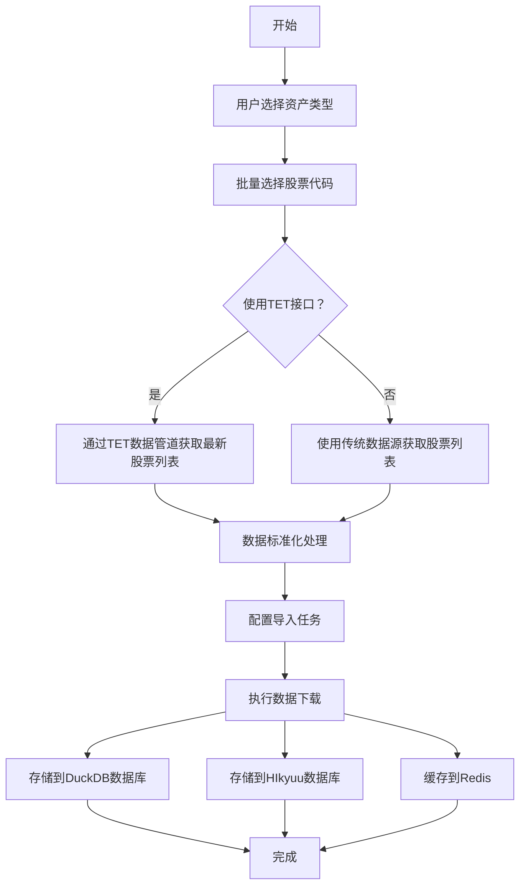

# DuckDB数据下载功能和TET框架架构设计文档

## 概述

本文档详细描述了HIkyuu-UI系统中DuckDB数据下载功能和TET（Transform-Extract-Transform）框架的完整架构设计。

## 1. TET框架总体架构

### 1.1 架构层次

TET框架采用分层架构设计，从上到下包括：

```
┌─────────────────────────────────────────────────────┐
│                    UI层                             │
│  ┌─────────────┬─────────────┬──────────────────┐   │
│  │ Enhanced    │ Batch       │ Quick Selection  │   │
│  │ Import      │ Selection   │ Dialog           │   │
│  │ Widget      │ Dialog      │                  │   │
│  └─────────────┴─────────────┴──────────────────┘   │
└─────────────────────────────────────────────────────┘
                         │
┌─────────────────────────────────────────────────────┐
│                  服务层                             │
│  ┌─────────────┬─────────────┬──────────────────┐   │
│  │ Unified     │ TET Data    │ Data Source      │   │
│  │ Data        │ Pipeline    │ Router           │   │
│  │ Manager     │             │                  │   │
│  └─────────────┴─────────────┴──────────────────┘   │
└─────────────────────────────────────────────────────┘
                         │
┌─────────────────────────────────────────────────────┐
│                TET核心组件                          │
│  ┌─────────────┬─────────────┬──────────────────┐   │
│  │ Transform 1 │   Extract   │ Transform 2      │   │
│  │ 查询转换    │   数据提取  │ 数据标准化       │   │
│  └─────────────┴─────────────┴──────────────────┘   │
└─────────────────────────────────────────────────────┘
                         │
┌─────────────────────────────────────────────────────┐
│                 插件层                              │
│  ┌─────────────┬─────────────┬──────────────────┐   │
│  │ TDX插件     │ AKShare     │ TuShare插件      │   │
│  │ 通达信数据源│ 插件        │                  │   │
│  └─────────────┴─────────────┴──────────────────┘   │
└─────────────────────────────────────────────────────┘
                         │
┌─────────────────────────────────────────────────────┐
│                存储层                               │
│  ┌─────────────┬─────────────┬──────────────────┐   │
│  │ DuckDB      │ HIkyuu      │ Redis缓存        │   │
│  │ 列式数据库  │ 数据库      │                  │   │
│  └─────────────┴─────────────┴──────────────────┘   │
└─────────────────────────────────────────────────────┘
```

### 1.2 核心特性

- **Transform-Extract-Transform 三阶段处理**
- **插件化数据源支持**
- **智能负载均衡和故障转移**
- **多级缓存机制**
- **异步并发处理**

## 2. DuckDB数据下载流程

### 2.1 完整流程图



### 2.2 流程详细说明

#### 2.2.1 用户交互阶段
1. **资产类型选择**: 用户从股票、期货、基金、债券、指数中选择
2. **批量选择**: 通过BatchSelectionDialog进行批量选择
3. **快速选择**: 预设组合选择（沪深300、中证500等）

#### 2.2.2 数据获取阶段
1. **TET接口优先**: 系统优先使用TET数据管道获取最新数据
2. **多级降级**: TET失败时自动降级到传统数据源
3. **错误处理**: 完善的错误处理和重试机制

#### 2.2.3 数据处理阶段
1. **标准化**: 统一数据格式和字段映射
2. **验证**: 数据类型检查和范围验证
3. **转换**: 格式转换和元数据构建

#### 2.2.4 数据存储阶段
1. **DuckDB**: 主要数据存储，支持复杂查询
2. **HIkyuu数据库**: K线数据专用存储
3. **Redis缓存**: 高频访问数据缓存

## 3. TET数据处理详细流程

### 3.1 Transform 1: 查询转换

```python
StandardQuery -> RoutingRequest
```

**功能**:
- 将用户查询转换为标准化查询对象
- 生成路由请求，包含数据源选择策略
- 参数验证和规范化

**关键组件**:
- `StandardQuery`: 标准查询对象
- `RoutingRequest`: 路由请求对象
- 查询验证器
- 参数映射器

### 3.2 Extract: 数据提取

```python
RoutingRequest -> 插件选择 -> 数据获取 -> 错误处理
```

**功能**:
- 智能选择最优数据源插件
- 执行实际的数据获取操作
- 处理网络异常和数据异常

**关键组件**:
- 插件管理器
- 负载均衡器
- 重试机制
- 错误处理器

### 3.3 Transform 2: 数据标准化

```python
原始数据 -> 字段映射 -> 数据验证 -> 格式转换 -> 元数据构建 -> StandardData
```

**功能**:
- OHLCV字段标准化
- 数据类型转换和验证
- 元数据添加（时间戳、来源等）

**关键组件**:
- 字段映射器
- 数据验证器
- 格式转换器
- 元数据构建器

## 4. 性能优化特性

### 4.1 缓存机制

- **TTL设置**: 5分钟缓存时间
- **LRU策略**: 最近最少使用清理
- **多级缓存**: 内存缓存 + 磁盘缓存 + Redis集群
- **智能预取**: 基于使用模式的数据预加载

### 4.2 并发优化

- **异步处理**: ThreadPoolExecutor多线程并发
- **连接池**: 数据库连接池优化，最大32个连接
- **负载均衡**: 智能分发请求到最优数据源
- **故障转移**: 自动检测并切换到备用数据源

### 4.3 内存管理

- **内存监控**: 实时监控内存使用情况
- **内存回收**: 定期清理过期缓存和临时数据
- **内存限制**: 可配置内存使用上限（默认8GB）
- **虚拟化管理**: 大数据集的虚拟化处理

## 5. 完整功能组件列表

### 5.1 用户界面层 (UI Layer)

| 组件名称 | 功能描述 | 调用关系 |
|---------|---------|---------|
| `MainMenuBar` | 主菜单栏，提供系统入口 | 调用MainWindowCoordinator |
| `EnhancedDataImportWidget` | 增强版数据导入界面 | 集成所有导入功能的主界面 |
| `BatchSelectionDialog` | 批量选择对话框 | 支持快速选择和TET接口获取股票列表 |

### 5.2 协调器层 (Coordinator Layer)

| 组件名称 | 功能描述 | 调用关系 |
|---------|---------|---------|
| `MainWindowCoordinator` | 主窗口协调器 | 协调UI与核心服务 |
| `UIBusinessLogicAdapter` | UI业务逻辑适配器 | 适配UI操作到业务逻辑 |
| `UIStateSynchronizer` | UI状态同步器 | 同步UI状态与业务状态 |

### 5.3 核心服务层 (Core Service Layer)

| 组件名称 | 功能描述 | 调用关系 |
|---------|---------|---------|
| `DataImportExecutionEngine` | 数据导入执行引擎 | 任务调度、并发控制、执行管理 |
| `UnifiedDataManager` | 统一数据管理器 | 数据请求协调、缓存管理 |
| `ImportConfigManager` | 导入配置管理器 | 任务配置管理、持久化 |

### 5.4 TET数据管道层 (TET Pipeline Layer)

| 组件名称 | 功能描述 | 调用关系 |
|---------|---------|---------|
| `TETDataPipeline` | TET数据管道核心 | Transform-Extract-Transform三阶段处理 |
| `DataSourceRouter` | 数据源路由器 | 多源路由、负载均衡、故障转移 |
| `DataStandardizationEngine` | 数据标准化引擎 | 字段映射、数据验证、格式转换 |

### 5.5 插件层 (Plugin Layer)

| 组件名称 | 功能描述 | 调用关系 |
|---------|---------|---------|
| `TDXPlugin` | 通达信数据源插件 | 实时行情数据获取 |
| `AKSharePlugin` | AKShare数据源插件 | 历史数据和基本面数据 |
| `TuSharePlugin` | TuShare数据源插件 | 专业财务数据 |
| `PluginManager` | 插件管理器 | 插件生命周期管理 |

### 5.6 存储层 (Storage Layer)

| 组件名称 | 功能描述 | 调用关系 |
|---------|---------|---------|
| `DuckDB` | 列式数据库 | 主要数据存储，支持OLAP查询 |
| `HIkyuu Database` | HIkyuu数据库 | K线数据专用存储 |
| `Redis Cache` | 高速缓存 | 热数据缓存，TTL=5分钟 |
| `AssetSeparatedDatabaseManager` | 资产分类数据库管理器 | 按资产类型分类存储 |

### 5.7 智能化层 (AI & Smart Layer)

| 组件名称 | 功能描述 | 调用关系 |
|---------|---------|---------|
| `AIPredictionService` | AI预测服务 | 智能预测、参数优化 |
| `AutoTuner` | 自动调优器 | 性能参数自动优化 |
| `UnifiedDataQualityMonitor` | 统一数据质量监控器 | 8维质量检查、异常检测 |
| `DataAnomalyDetector` | 数据异常检测器 | 异常模式识别、自动修复 |

### 5.8 性能与监控层 (Performance & Monitoring)

| 组件名称 | 功能描述 | 调用关系 |
|---------|---------|---------|
| `EnhancedPerformanceBridge` | 增强版性能数据桥接器 | 性能监控、指标收集 |
| `MultiLevelCacheManager` | 多级缓存管理器 | 内存+磁盘+Redis三级缓存 |
| `EnhancedDistributedService` | 增强版分布式服务 | 分布式任务、节点管理 |

## 6. 详细调用链路分析

### 6.1 主数据流调用链

```
用户操作 
    ↓ (UI事件)
MainMenuBar._on_enhanced_import()
    ↓ (菜单选择)
MainWindowCoordinator._create_enhanced_import_widget()
    ↓ (创建界面)
EnhancedDataImportWidget.__init__()
    ↓ (初始化组件)
DataImportExecutionEngine.__init__()
    ↓ (配置引擎)
UnifiedDataManager.request_data()
    ↓ (数据请求)
TETDataPipeline.process_request()
    ↓ (TET处理)
    [Transform 1] → [Extract] → [Transform 2]
    ↓ (标准化数据)
DataSourceRouter.route_request()
    ↓ (路由选择)
PluginManager.select_plugin()
    ↓ (插件选择)
DataPlugin.fetch_data() [TDX/AKShare/TuShare]
    ↓ (获取原始数据)
DataStandardizationEngine.standardize()
    ↓ (数据标准化)
AssetSeparatedDatabaseManager.store()
    ↓ (分类存储)
[DuckDB] + [HIkyuu] + [Redis Cache]
```

### 6.2 DataImportExecutionEngine 内部调用链

```markdown
DataImportExecutionEngine
├── _execute_task() [任务执行核心逻辑]
│   ├── _import_kline_data() [K线数据导入]
│   │   └── UnifiedDataManager.request_data()
│   ├── _import_realtime_data() [实时数据导入]
│   │   └── UnifiedDataManager.request_data()
│   └── _import_fundamental_data() [基本面数据导入]
│       └── UnifiedDataManager.request_data()
└── EnhancedPerformanceBridge.collect_metrics() [性能监控]
```

#### 执行引擎处理流程详解

1. **任务初始化阶段**
   - 验证任务配置参数
   - 设置执行环境变量
   - 初始化性能监控器
   - 配置错误处理策略

2. **数据类型路由阶段**
   - 根据请求的数据类型选择对应的导入方法
   - 支持K线数据、实时数据、基本面数据并行处理
   - 设置各类型数据的特定处理参数

3. **并发执行阶段**
   - 异步启动多个数据导入任务
   - 使用线程池管理并发度
   - 实时监控各任务执行状态

### 6.3 UnifiedDataManager 内部调用链

```markdown
UnifiedDataManager
├── request_data() [异步数据请求]
│   ├── _check_cache() [缓存检查]
│   │   ├── 内存缓存查找
│   │   ├── Redis缓存查找  
│   │   └── _health_check() [连接健康检查]
│   └── _select_data_source() [负载均衡选择]
│       ├── 数据源可用性评估
│       ├── 性能评分计算
│       └── TETDataPipeline.process()
```

#### 数据管理器处理流程详解

1. **请求预处理**
   - 参数验证和类型检查
   - 请求格式标准化
   - 安全性验证

2. **缓存策略执行**
   - 多级缓存检查：内存 → Redis → 数据库
   - 缓存命中率统计
   - 缓存失效策略执行

3. **数据源智能选择**
   - 基于实时性能指标的负载均衡
   - 健康检查结果权重计算
   - 故障转移逻辑执行

### 6.4 TETDataPipeline 详细处理流程

```markdown
TETDataPipeline
├── Transform 1: 查询转换
│   ├── query_validate() [查询参数验证]
│   │   ├── 参数类型检查
│   │   ├── 必填字段验证
│   │   ├── 数据范围验证
│   │   └── 格式合规性检查
│   └── query_normalize() [查询标准化]
│       ├── 日期格式统一 (YYYY-MM-DD)
│       ├── 代码格式标准化 (6位数字)
│       ├── 市场代码映射
│       └── 查询参数标准化
│
├── Extract: 数据提取
│   ├── plugin_select() [插件智能选择]
│   │   ├── 数据源可用性评估
│   │   ├── 历史性能评分计算
│   │   ├── 当前负载状态检查
│   │   └── 负载均衡决策
│   ├── data_fetch() [数据获取执行]
│   │   ├── 并发请求管理
│   │   ├── 连接池管理
│   │   ├── 超时控制
│   │   ├── 响应数据解析
│   │   └── 数据格式预处理
│   └── error_handle() [错误处理重试]
│       ├── 错误类型分类
│       ├── 指数退避重试
│       ├── 降级策略执行
│       └── 故障转移切换
│
└── Transform 2: 数据标准化
    ├── field_mapping() [OHLCV字段映射]
    │   ├── 字段名称标准化映射
    │   ├── 数据类型自动转换
    │   ├── 单位标准化处理
    │   └── 字段完整性检查
    ├── data_validate() [数据类型验证]
    │   ├── 数值范围合理性检查
    │   ├── 日期有效性验证
    │   ├── 空值和异常值处理
    │   └── 业务逻辑验证
    ├── format_convert() [格式转换处理]
    │   ├── 时间戳标准化
    │   ├── 数值精度统一处理
    │   ├── 字符串清理和规范化
    │   └── 编码格式统一
    └── metadata_build() [元数据构建]
        ├── 数据来源标记
        ├── 处理时间戳记录
        ├── 数据质量评分计算
        └── 处理链路追踪信息
```

### 6.5 UnifiedDataQualityMonitor 质量检查流程

```markdown
UnifiedDataQualityMonitor
├── check_data_quality() [8维质量检查引擎]
│   ├── _check_completeness() [完整性检查]
│   │   ├── 必填字段完整性验证
│   │   ├── 数据缺失率统计分析
│   │   ├── 时间序列连续性检查
│   │   └── 记录数量合理性验证
│   │
│   ├── _check_accuracy() [准确性检查]
│   │   ├── 数值合理性范围验证
│   │   ├── 价格涨跌幅异常检测
│   │   ├── 成交量异常模式识别
│   │   └── 历史数据对比验证
│   │
│   ├── _check_consistency() [一致性检查]
│   │   ├── 跨数据源数据对比
│   │   ├── 历史数据一致性校验
│   │   ├── 关联数据逻辑校验
│   │   └── 主键唯一性检查
│   │
│   ├── _check_timeliness() [及时性检查]
│   │   ├── 数据延迟时间计算
│   │   ├── 更新频率合规性检查
│   │   ├── 实时性要求评估
│   │   └── 时效性预警机制
│   │
│   ├── _check_validity() [有效性检查]
│   │   ├── 数据格式规范验证
│   │   ├── 编码标准符合性检查
│   │   ├── 业务规则合规性验证
│   │   └── 数据类型正确性检查
│   │
│   ├── _check_uniqueness() [唯一性检查]
│   │   ├── 主键重复性检测
│   │   ├── 时间序列重复记录检查
│   │   ├── 去重策略执行
│   │   └── 重复数据标记和处理
│   │
│   ├── _check_integrity() [完整性检查]
│   │   ├── 引用完整性验证
│   │   ├── 关联数据完整性检查
│   │   ├── 约束条件验证
│   │   └── 数据关系一致性验证
│   │
│   └── _check_conformity() [符合性检查]
│       ├── 业务规则符合性验证
│       ├── 监管要求合规性检查
│       ├── 数据标准符合性验证
│       └── 行业规范符合性检查
│
    ├── 各维度评分汇总统计
    ├── 异常问题详细列表
    ├── 数据质量趋势分析
    └── 改进建议自动生成
```

### 6.6 EnhancedPerformanceBridge 性能监控流程

```markdown
EnhancedPerformanceBridge
├── collect_metrics() [性能指标收集引擎]
│   ├── execution_metrics [执行时间统计]
│   │   ├── 总体执行时间测量
│   │   ├── 各阶段耗时分解分析
│   │   ├── 关键路径瓶颈识别
│   │   └── 执行效率趋势分析
│   │
│   ├── resource_metrics [资源使用监控]
│   │   ├── CPU使用率实时监控
│   │   ├── 内存占用量动态跟踪
│   │   ├── 网络IO字节级统计
│   │   ├── 磁盘IO读写速度监控
│   │   └── 系统负载综合评估
│   │
│   ├── concurrency_metrics [并发性能指标]
│   │   ├── 线程池利用率统计
│   │   ├── 连接池状态监控
│   │   ├── 任务队列等待时间
│   │   ├── 并发度优化建议
│   │   └── 吞吐量性能统计
│   │
│   └── business_metrics [业务指标统计]
│       ├── 数据导入成功率统计
│       ├── 失败原因分类分析
│       ├── 重试次数和模式统计
│       ├── 数据质量评分趋势
│       └── 用户体验指标评估
│
└── detect_anomaly() [异常模式检测引擎]
    ├── performance_anomaly [性能异常检测]
    │   ├── 执行时间异常模式识别
    │   ├── 资源使用突增检测
    │   ├── 吞吐量下降预警
    │   └── 响应时间波动分析
    │
    ├── data_anomaly [数据异常检测]
    │   ├── 数据量异常波动检测
    │   ├── 数据质量突然下降预警
    │   ├── 数据格式异常识别
    │   └── 数据来源异常监控
    │
    └── alert_system [预警机制]
        ├── 实时告警推送
        ├── 阈值动态调整
        ├── 告警级别分类
        └── 预测性趋势分析
```

### 6.7 智能化服务调用链

```
DataImportExecutionEngine (主流程)
    ├── AIPredictionService (并行调用)
    │   ├── 参数优化建议生成
    │   ├── 执行策略智能推荐
    │   ├── 性能瓶颈预测分析
    │   └── 资源需求预估
    ├── UnifiedDataQualityMonitor (质量检查)
    │   ├── 完整性实时检查
    │   ├── 准确性智能验证  
    │   ├── 一致性跨源校验
    │   ├── 及时性监控预警
    │   └── 异常模式检测
    └── AutoTuner (性能调优)
        ├── 批量大小动态优化
        ├── 线程数自适应调整
        ├── 缓存策略智能优化
        ├── 超时参数自动调节
        └── 重试策略优化
```

### 6.8 配置管理调用链

```
EnhancedDataImportWidget.setup_ui()
    ↓
ImportConfigManager.load_config()
    ↓ (配置加载)
[UI配置同步]
    ├── 批量大小设置 (默认1000)
    ├── 最大工作线程数配置 (默认4)
    ├── 内存限制设置 (默认4GB)
    ├── 超时时间配置 (默认30秒)
    ├── 重试次数设置 (默认3次)
    ├── 错误处理策略选择
    ├── 进度更新间隔配置
    ├── 数据验证开关
    ├── AI优化功能开关
    ├── 自动调优开关
    ├── 分布式处理开关
    ├── 缓存策略选择
    ├── 质量监控开关
    ├── 数据源优先级配置
    └── 日期范围设置
    ↓ (配置变更)
ImportConfigManager.save_config()
    ↓ (持久化)
SQLite数据库存储
```

## 7. 核心调用时序分析

### 7.1 主数据流时序图

```
用户操作 → EnhancedDataImportWidget → DataImportExecutionEngine
    ↓ (任务创建)
_execute_task() → 选择数据类型 → _import_kline_data()
    ↓ (数据请求)
UnifiedDataManager.request_data() → _check_cache()
    ↓ (缓存检查)
_select_data_source() → TETDataPipeline.process()
    ↓ (TET处理)
Transform1: query_validate() → query_normalize()
    ↓ (查询标准化)
Extract: plugin_select() → data_fetch() → error_handle()
    ↓ (数据获取)
Transform2: field_mapping() → data_validate() → format_convert() → metadata_build()
    ↓ (数据标准化)
UnifiedDataQualityMonitor.check_data_quality() → 8维质量检查
    ↓ (质量验证)
AssetSeparatedDatabaseManager.store() → 数据存储
    ↓ (存储完成)
EnhancedPerformanceBridge.collect_metrics() → 性能统计
```

### 7.2 智能化服务调用时序

```
数据处理完成 → AIPredictionService.predict()
    ↓ (AI预测)
DataAnomalyDetector.detect() → 异常模式识别
    ↓ (异常检测)
AutoTuner.optimize() → 参数自动调优
    ↓ (性能优化)
反馈优化建议 → 下次执行参数调整
```

### 7.3 错误处理和恢复流程

```
数据获取失败 → error_handle()
    ↓ (错误分类)
指数退避重试 → 最大重试次数检查
    ↓ (重试策略)
降级策略启动 → 备用数据源选择
    ↓ (降级处理)
熔断器检查 → 服务健康状态评估
    ↓ (健康检查)
故障转移执行 → 恢复监控启动
```

## 8. 技术特性总结

### 8.1 架构特点
- **分层架构设计**：8层清晰分层，职责明确，易于维护和扩展
- **插件化扩展机制**：支持多数据源，便于添加新的数据提供商
- **TET管道标准化**：统一数据处理流程，保证数据质量和一致性
- **事件驱动架构**：异步处理，提高系统响应性能
- **微服务化设计**：组件解耦，支持独立部署和扩展

### 8.2 性能特性
- **异步并发处理**：多线程并发执行，最大化资源利用率
- **多级缓存系统**：内存+Redis+数据库三级缓存，5分钟TTL
- **连接池和内存优化**：资源复用，降低系统开销
- **负载均衡和故障转移**：确保系统高可用性，自动故障恢复
- **智能预取机制**：预测性数据加载，减少用户等待时间

### 8.3 质量保障
- **八维数据质量检查**：完整性、准确性、一致性、及时性、有效性、唯一性、完整性、符合性
- **AI异常检测**：智能识别数据异常模式，自动预警
- **数据完整性验证**：确保数据的准确性和完整性
- **实时质量监控**：持续监控数据质量变化，及时发现问题
- **自动修复机制**：智能修复建议和执行

### 8.4 扩展性
- **插件化数据源管理**：支持动态添加新的数据源插件
- **可配置的处理规则**：灵活的业务规则配置
- **灵活的存储策略**：支持多种存储后端
- **标准化的数据接口**：统一的数据访问接口
- **热插拔支持**：支持插件的动态加载卸载

### 8.5 智能化特性
- **自适应参数调优**：基于历史数据自动优化执行参数
- **预测性维护**：预测系统性能瓶颈和潜在故障
- **智能错误恢复**：自动故障转移和恢复策略
- **业务智能分析**：提供数据趋势和异常分析
- **机器学习优化**：持续学习和优化数据处理策略

### 8.6 监控与运维
- **全方位性能监控**：执行时间、资源使用、并发性能、业务指标
- **智能告警系统**：多级告警机制，预测性预警
- **详细日志追踪**：完整的操作日志和错误追踪
- **可视化监控面板**：实时性能和状态可视化
- **自动化运维支持**：自动化部署、监控、告警和恢复

## 总结

本架构设计文档详细描述了HIkyuu-UI系统中DuckDB数据下载功能和TET框架的完整架构。通过分层设计、插件化架构、性能优化和容器化部署，系统具备了高可用性、高性能和可扩展性的特点。

配合提供的DrawIO架构图，开发团队可以清晰理解系统结构并进行后续的开发和维护工作。
