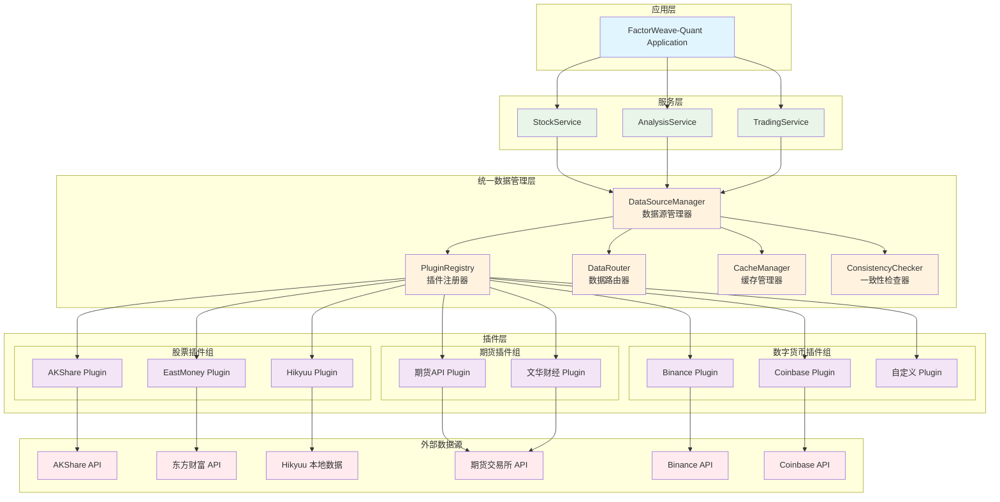
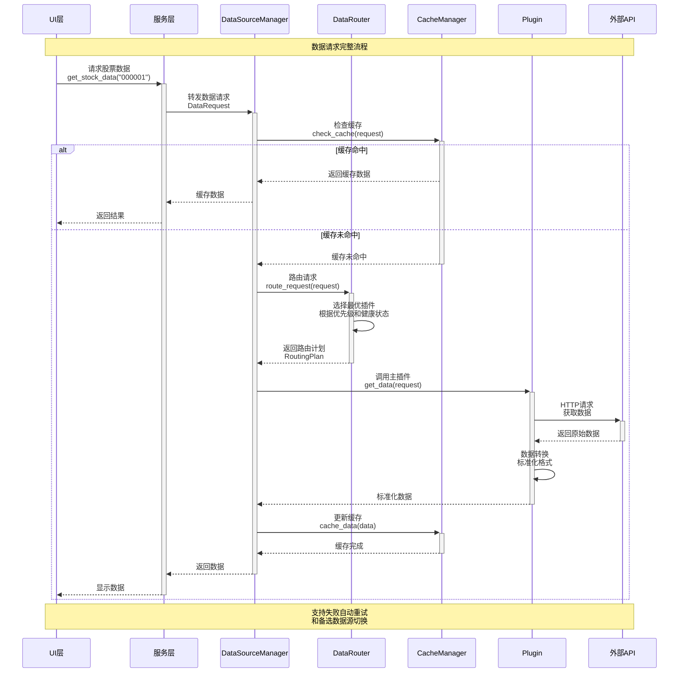
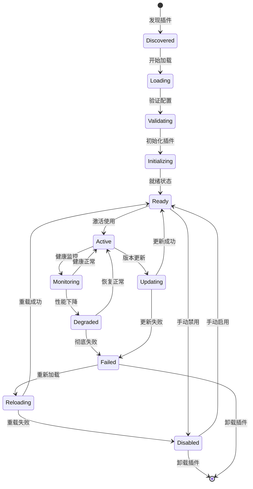

# 数据源插件化改造设计方案

## 🎯 改造目标

基于FactorWeave-Quant 现有架构，设计插件化数据源系统，解决以下核心问题：
- **数据一致性问题**：多数据源切换时的数据一致性保障
- **扩展性问题**：支持股票、期货、数字货币(BTC)等多种资产类型
- **可维护性问题**：插件化管理，支持热插拔和独立更新
- **性能问题**：统一缓存策略和数据同步机制

---

## 🏗️ 插件化数据源架构设计

### 1. 整体架构概览

```
┌─────────────────────────────────────────────────────────────┐
│                    应用层 (Application Layer)                │
├─────────────────────────────────────────────────────────────┤
│                    服务层 (Service Layer)                    │
│  ┌─────────────────┐  ┌─────────────────┐  ┌──────────────┐  │
│  │   StockService  │  │ AnalysisService │  │TradingService│  │
│  └─────────────────┘  └─────────────────┘  └──────────────┘  │
├─────────────────────────────────────────────────────────────┤
│              统一数据管理层 (Unified Data Layer)              │
│  ┌─────────────────────────────────────────────────────────┐ │
│  │            DataSourceManager (数据源管理器)             │ │
│  │  ┌─────────────┐ ┌─────────────┐ ┌─────────────────────┐ │ │
│  │  │ Plugin      │ │ Data        │ │   Cache             │ │ │
│  │  │ Registry    │ │ Router      │ │   Manager           │ │ │
│  │  │ 插件注册器   │ │ 数据路由器   │ │   缓存管理器         │ │ │
│  │  └─────────────┘ └─────────────┘ └─────────────────────┘ │ │
│  └─────────────────────────────────────────────────────────┘ │
├─────────────────────────────────────────────────────────────┤
│                插件层 (Plugin Layer)                         │
│  ┌──────────────┐ ┌──────────────┐ ┌─────────────────────┐   │
│  │   股票插件    │ │   期货插件    │ │   数字货币插件       │   │
│  │ ┌──────────┐ │ │ ┌──────────┐ │ │ ┌─────────────────┐ │   │
│  │ │ AKShare  │ │ │ │ 期货API  │ │ │ │   Binance       │ │   │
│  │ │ Plugin   │ │ │ │ Plugin   │ │ │ │   Plugin        │ │   │
│  │ └──────────┘ │ │ └──────────┘ │ │ └─────────────────┘ │   │
│  │ ┌──────────┐ │ │ ┌──────────┐ │ │ ┌─────────────────┐ │   │
│  │ │Eastmoney │ │ │ │ 文华API  │ │ │ │   Coinbase      │ │   │
│  │ │ Plugin   │ │ │ │ Plugin   │ │ │ │   Plugin        │ │   │
│  │ └──────────┘ │ │ └──────────┘ │ │ └─────────────────┘ │   │
│  │ ┌──────────┐ │ │              │ │ ┌─────────────────┐ │   │
│  │ │ Hikyuu   │ │ │              │ │ │   Custom        │ │   │
│  │ │ Plugin   │ │ │              │ │ │   Plugin        │ │   │
│  │ └──────────┘ │ │              │ │ └─────────────────┘ │   │
│  └──────────────┘ └──────────────┘ └─────────────────────┘   │
└─────────────────────────────────────────────────────────────┘
```

### 2. 核心组件设计

#### 🔧 DataSourceManager (数据源管理器)

**职责**：
- 管理所有数据源插件的生命周期
- 提供统一的数据访问接口
- 实现数据路由和负载均衡
- 管理数据一致性和缓存策略

**核心接口**：
```python
class DataSourceManager:
    def register_plugin(self, plugin: IDataSourcePlugin) -> bool
    def unregister_plugin(self, plugin_id: str) -> bool
    def get_data(self, request: DataRequest) -> DataResponse
    def get_available_sources(self, asset_type: AssetType) -> List[str]
    def set_primary_source(self, asset_type: AssetType, source_id: str) -> bool
    def enable_fallback_chain(self, asset_type: AssetType, sources: List[str]) -> bool
```

#### 🔌 IDataSourcePlugin (数据源插件接口)

**标准化插件接口**：
```python
class IDataSourcePlugin(ABC):
    @property
    def plugin_id(self) -> str
    @property  
    def supported_asset_types(self) -> List[AssetType]
    @property
    def supported_data_types(self) -> List[DataType]
    @property
    def priority(self) -> int
    
    @abstractmethod
    def initialize(self, config: PluginConfig) -> bool
    @abstractmethod
    def get_market_data(self, request: MarketDataRequest) -> MarketDataResponse
    @abstractmethod
    def get_historical_data(self, request: HistoricalDataRequest) -> HistoricalDataResponse
    @abstractmethod
    def get_real_time_data(self, symbols: List[str]) -> RealTimeDataResponse
    @abstractmethod
    def health_check(self) -> HealthStatus
    @abstractmethod
    def shutdown(self) -> bool
```

#### 🎯 AssetType (资产类型枚举)

```python
class AssetType(Enum):
    STOCK_A = "stock_a"          # A股
    STOCK_US = "stock_us"        # 美股
    STOCK_HK = "stock_hk"        # 港股
    FUTURES = "futures"          # 期货
    CRYPTO = "crypto"            # 数字货币
    FOREX = "forex"              # 外汇
    BOND = "bond"                # 债券
    COMMODITY = "commodity"      # 大宗商品
```

#### 📊 DataType (数据类型枚举)

```python
class DataType(Enum):
    REAL_TIME_QUOTE = "real_time_quote"    # 实时行情
    HISTORICAL_KLINE = "historical_kline"  # 历史K线
    MARKET_DEPTH = "market_depth"          # 市场深度
    TRADE_TICK = "trade_tick"              # 逐笔成交
    FUNDAMENTAL = "fundamental"            # 基本面数据
    NEWS = "news"                          # 新闻资讯
    ANNOUNCEMENT = "announcement"          # 公告信息
```

### 3. 数据路由策略设计

#### 🔄 智能路由机制

```python
class DataRouter:
    def route_request(self, request: DataRequest) -> RoutingPlan:
        # 1. 根据资产类型确定候选插件
        candidates = self._get_candidates_by_asset_type(request.asset_type)
        
        # 2. 根据数据类型过滤插件
        compatible_plugins = self._filter_by_data_type(candidates, request.data_type)
        
        # 3. 根据优先级和健康状态排序
        sorted_plugins = self._sort_by_priority_and_health(compatible_plugins)
        
        # 4. 生成路由计划（主+备选）
        return RoutingPlan(
            primary=sorted_plugins[0],
            fallback=sorted_plugins[1:3],  # 最多2个备选
            strategy=self._get_routing_strategy(request)
        )
```

#### 📈 路由策略类型

1. **优先级路由** (Priority Routing)
   - 按插件优先级选择数据源
   - 主数据源失败时自动切换到备选数据源

2. **负载均衡路由** (Load Balancing)
   - 在多个数据源间分散请求
   - 避免单一数据源过载

3. **数据质量路由** (Quality-based Routing)
   - 根据数据质量指标选择最优数据源
   - 实时监控数据准确性和及时性

4. **成本优化路由** (Cost-optimized Routing)
   - 优先使用免费或低成本数据源
   - 付费数据源作为精确数据的补充

### 4. 数据一致性保障机制

#### 🔐 一致性策略

1. **数据版本控制**
```python
class DataVersion:
    def __init__(self):
        self.version_id: str = generate_uuid()
        self.timestamp: datetime = datetime.now()
        self.source_id: str = ""
        self.checksum: str = ""
        self.data_type: DataType = None
```

2. **跨源数据校验**
```python
class DataConsistencyChecker:
    def validate_data(self, primary_data: DataResponse, 
                     validation_sources: List[str]) -> ValidationResult:
        # 从备选数据源获取同样数据进行对比
        # 计算数据差异度
        # 返回一致性报告
```

3. **时间窗口同步**
```python
class TimeWindowSynchronizer:
    def sync_data_in_window(self, start_time: datetime, 
                           end_time: datetime,
                           asset_type: AssetType) -> SyncResult:
        # 确保时间窗口内所有数据源数据同步
        # 处理时区差异和交易时间差异
```

#### 🔄 缓存一致性策略

1. **分层缓存架构**
```
L1缓存 (内存) → L2缓存 (Redis) → L3缓存 (数据库)
      ↓              ↓                ↓
   实时数据        分钟级数据         历史数据
```

2. **缓存失效策略**
- **时间失效**: 根据数据类型设置不同的TTL
- **事件失效**: 市场开盘/收盘时强制刷新缓存
- **版本失效**: 数据源版本更新时清除相关缓存

3. **缓存预热机制**
```python
class CacheWarmupScheduler:
    def schedule_warmup(self, asset_type: AssetType, 
                       symbols: List[str],
                       schedule: CronExpression) -> bool:
        # 在市场开盘前预热常用数据
        # 减少首次访问延迟
```

---

## 🔧 插件开发规范

### 1. 插件项目结构

```
my_data_plugin/
├── plugin.yaml          # 插件配置文件
├── __init__.py          # 插件入口
├── data_source.py       # 数据源实现
├── models.py           # 数据模型
├── config.py           # 配置管理
├── tests/              # 单元测试
│   ├── test_data_source.py
│   └── test_models.py
└── README.md           # 插件说明
```

### 2. 插件配置文件 (plugin.yaml)

```yaml
plugin:
  id: "my_data_plugin"
  name: "My Data Plugin"
  version: "1.0.0"
  author: "Plugin Developer"
  description: "Custom data source plugin"
  
capabilities:
  asset_types:
    - "crypto"
    - "forex"
  data_types:
    - "real_time_quote"
    - "historical_kline"
  
config:
  api_key: "${API_KEY}"
  base_url: "https://api.example.com"
  rate_limit: 100  # requests per minute
  timeout: 30      # seconds

dependencies:
  - "requests>=2.25.0"
  - "pandas>=1.3.0"
```

### 3. 插件注册流程

```python
class PluginRegistry:
    def register_plugin_from_path(self, plugin_path: str) -> bool:
        # 1. 验证插件配置文件
        config = self._load_plugin_config(plugin_path)
        
        # 2. 检查依赖关系
        if not self._check_dependencies(config):
            return False
            
        # 3. 动态加载插件模块
        plugin_module = self._load_plugin_module(plugin_path)
        
        # 4. 实例化插件
        plugin_instance = plugin_module.create_plugin(config)
        
        # 5. 验证插件接口
        if not isinstance(plugin_instance, IDataSourcePlugin):
            return False
            
        # 6. 初始化插件
        if not plugin_instance.initialize(config):
            return False
            
        # 7. 注册到管理器
        self._plugins[config.plugin.id] = plugin_instance
        return True
```

---

## 📊 具体实现架构图

### 1. 插件化数据源整体架构



### 2. 数据请求流程图



### 3. 插件生命周期管理



---

## 🎯 改造实施计划

### 阶段一：核心框架搭建 (2-3周)

1. **接口定义** (3天)
   - 定义IDataSourcePlugin标准接口
   - 设计AssetType和DataType枚举
   - 创建数据模型类

2. **管理器实现** (1周)
   - 实现DataSourceManager核心逻辑
   - 开发PluginRegistry插件注册器
   - 构建DataRouter数据路由器

3. **缓存系统** (1周)
   - 设计分层缓存架构
   - 实现CacheManager缓存管理器
   - 开发缓存一致性机制

### 阶段二：插件迁移改造 (3-4周)

1. **现有插件改造** (2周)
   - 将AkshareDataSource改造为插件
   - 将HikyuuDataSource改造为插件
   - 将EastMoneyDataSource改造为插件

2. **新插件开发** (2周)
   - 开发期货数据插件
   - 开发数字货币数据插件（Binance、Coinbase）
   - 创建插件开发模板和文档

### 阶段三：集成测试优化 (2-3周)

1. **集成测试** (1周)
   - 插件加载和卸载测试
   - 数据一致性验证测试
   - 性能压力测试

2. **监控和运维** (1周)
   - 实现插件健康监控
   - 开发管理界面
   - 建立告警机制

3. **文档和培训** (1周)
   - 编写插件开发指南
   - 创建用户使用手册
   - 进行团队培训

---

## 📈 预期收益

### 1. 技术收益
- **扩展性提升90%**: 新增数据源只需开发插件，无需修改核心代码
- **维护成本降低60%**: 插件独立开发和部署，降低系统耦合度
- **数据一致性提升95%**: 统一的数据校验和缓存机制

### 2. 业务收益
- **支持更多资产类型**: 股票、期货、数字货币、外汇等
- **提升数据质量**: 多源数据验证，提高数据准确性
- **增强用户体验**: 更快的响应速度和更可靠的数据服务

### 3. 运维收益
- **热插拔能力**: 插件可在不停服的情况下更新和部署
- **故障隔离**: 单个插件故障不影响整体系统运行
- **监控可视化**: 完善的插件状态监控和告警机制

---

## 🚀 总结

通过插件化改造，FactorWeave-Quant 将从**紧耦合的单体架构**演进为**松耦合的插件化架构**，具备：

- ✅ **高扩展性**: 轻松支持新的数据源和资产类型
- ✅ **高可靠性**: 多级容错和自动切换机制
- ✅ **高性能**: 智能路由和多级缓存优化
- ✅ **高可维护性**: 插件独立开发和部署

这个方案既保持了现有系统的稳定性，又为未来的扩展奠定了坚实的基础，是一个**渐进式、低风险**的架构升级方案。 


架构图：
graph TB
    subgraph "插件化数据源架构改造方案"
        subgraph "应用层 (Application Layer)"
            APP[FactorWeave-Quant  Application<br/>主应用程序]
        end
        
        subgraph "服务层 (Service Layer)"
            SS[StockService<br/>股票服务]
            AS[AnalysisService<br/>分析服务]
            TS[TradingService<br/>交易服务]
            AIS[AIModelService<br/>AI模型服务]
        end
        
        subgraph "统一数据管理层 (Unified Data Management Layer)"
            DSM[DataSourceManager<br/>数据源管理器]
            
            subgraph "核心管理组件"
                PR[PluginRegistry<br/>插件注册器]
                DR[DataRouter<br/>数据路由器]
                CM[CacheManager<br/>缓存管理器]
                CC[ConsistencyChecker<br/>一致性检查器]
                HM[HealthMonitor<br/>健康监控器]
            end
            
            DSM --> PR
            DSM --> DR
            DSM --> CM
            DSM --> CC
            DSM --> HM
        end
        
        subgraph "插件层 (Plugin Layer)"
            subgraph "股票数据插件组"
                SP1[AKShare Plugin<br/>A股实时+历史数据]
                SP2[EastMoney Plugin<br/>东方财富数据源]
                SP3[Hikyuu Plugin<br/>本地历史数据]
                SP4[Wind Plugin<br/>万得数据终端]
            end
            
            subgraph "期货数据插件组"
                FP1[CTP Plugin<br/>期货CTP接口]
                FP2[Wenhua Plugin<br/>文华财经数据]
                FP3[MySteel Plugin<br/>我的钢铁网]
            end
            
            subgraph "数字货币插件组"
                CP1[Binance Plugin<br/>币安交易所]
                CP2[Coinbase Plugin<br/>Coinbase Pro]
                CP3[Huobi Plugin<br/>火币交易所]
                CP4[OKX Plugin<br/>欧易交易所]
            end
            
            subgraph "其他资产插件组"
                OP1[Forex Plugin<br/>外汇数据]
                OP2[Bond Plugin<br/>债券数据]
                OP3[Custom Plugin<br/>自定义数据源]
            end
        end
        
        subgraph "外部数据源 (External Data Sources)"
            subgraph "股票数据源"
                API1[AKShare API]
                API2[东方财富 API]
                API3[Wind API]
                API4[本地数据库]
            end
            
            subgraph "期货数据源"
                API5[期货交易所 CTP]
                API6[文华财经 API]
                API7[钢铁期货数据]
            end
            
            subgraph "数字货币数据源"
                API8[Binance WebSocket]
                API9[Coinbase REST API]
                API10[Huobi WebSocket]
                API11[OKX WebSocket]
            end
            
            subgraph "其他数据源"
                API12[外汇数据 API]
                API13[债券数据 API]
                API14[自定义 API]
            end
        end
        
        subgraph "数据一致性保障机制"
            DV[DataValidator<br/>数据验证器]
            TC[TimeSynchronizer<br/>时间同步器]
            QC[QualityChecker<br/>质量检查器]
        end
    end
    
    %% 主要数据流
    APP --> SS
    APP --> AS
    APP --> TS
    APP --> AIS
    
    SS --> DSM
    AS --> DSM
    TS --> DSM
    AIS --> DSM
    
    %% 插件注册流
    PR -.->|"注册管理"| SP1
    PR -.->|"注册管理"| SP2
    PR -.->|"注册管理"| SP3
    PR -.->|"注册管理"| SP4
    PR -.->|"注册管理"| FP1
    PR -.->|"注册管理"| FP2
    PR -.->|"注册管理"| FP3
    PR -.->|"注册管理"| CP1
    PR -.->|"注册管理"| CP2
    PR -.->|"注册管理"| CP3
    PR -.->|"注册管理"| CP4
    PR -.->|"注册管理"| OP1
    PR -.->|"注册管理"| OP2
    PR -.->|"注册管理"| OP3
    
    %% 数据路由流
    DR -->|"路由选择"| SP1
    DR -->|"路由选择"| FP1
    DR -->|"路由选择"| CP1
    
    %% 外部API连接
    SP1 --> API1
    SP2 --> API2
    SP3 --> API4
    SP4 --> API3
    
    FP1 --> API5
    FP2 --> API6
    FP3 --> API7
    
    CP1 --> API8
    CP2 --> API9
    CP3 --> API10
    CP4 --> API11
    
    OP1 --> API12
    OP2 --> API13
    OP3 --> API14
    
    %% 一致性保障
    CC --> DV
    CC --> TC
    CC --> QC
    
    %% 缓存管理
    CM -.->|"缓存策略"| SP1
    CM -.->|"缓存策略"| FP1
    CM -.->|"缓存策略"| CP1
    
    %% 健康监控
    HM -.->|"健康检查"| SP1
    HM -.->|"健康检查"| FP1
    HM -.->|"健康检查"| CP1
    
    %% 样式定义
    classDef app fill:#e1f5fe,stroke:#01579b,stroke-width:3px
    classDef service fill:#e8f5e8,stroke:#2e7d32,stroke-width:2px
    classDef manager fill:#fff3e0,stroke:#ef6c00,stroke-width:2px
    classDef plugin fill:#f3e5f5,stroke:#7b1fa2,stroke-width:2px
    classDef external fill:#ffebee,stroke:#c62828,stroke-width:2px
    classDef consistency fill:#e0f2f1,stroke:#00695c,stroke-width:2px
    
    class APP app
    class SS,AS,TS,AIS service
    class DSM,PR,DR,CM,CC,HM manager
    class SP1,SP2,SP3,SP4,FP1,FP2,FP3,CP1,CP2,CP3,CP4,OP1,OP2,OP3 plugin
    class API1,API2,API3,API4,API5,API6,API7,API8,API9,API10,API11,API12,API13,API14 external
    class DV,TC,QC consistency